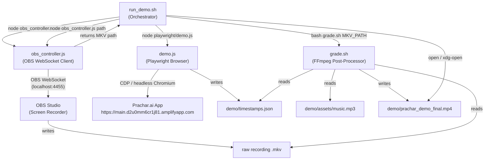

# Design Document: Demo Recording Automation

## Overview

The Demo Recording Automation Pipeline is a four-component toolchain that produces a broadcast-ready 60–90 second MP4 video of the Prachar.ai application from a single command. The pipeline coordinates a Playwright browser automation script, an OBS Studio WebSocket controller, an FFmpeg post-processing pipeline, and a master shell orchestrator.

The four components are deliberately decoupled with file-based handoff points (`timestamps.json`, the raw MKV recording) so each component can be developed, tested, and replaced independently. The master script (`run_demo.sh`) is the only component that knows the full execution order; the other three components are ignorant of one another.

**Key design decisions:**
- OBS Studio handles screen capture (not Playwright's built-in video) to guarantee 1920×1080 at 60 fps with 40 Mbps bitrate without browser codec limitations.
- `timestamps.json` is written by the browser script before OBS stops, creating a strict ordering guarantee without requiring inter-process communication.
- The FFmpeg filter graph is assembled as a shell string at runtime from `timestamps.json` values, allowing speed ramps and zoom punches to be data-driven without re-running Playwright.
- All environment configuration lives in `demo/.env`; no values are hardcoded in source files.

---

## Architecture

### System Data Flow



### Execution Sequence with Ordering Guarantees

```
run_demo.sh
│
├─ [CHECK] ffmpeg in PATH?  → exit 1 if not
├─ [CHECK] node in PATH?    → exit 1 if not
├─ [CHECK] OBS process running? → exit 1 if not
├─ source demo/.env
│
├─ node obs_controller.js start   ← OBS connects, verifies scene, starts recording
├─ sleep 2s
├─ node playwright/demo.js        ← 14-shot sequence executes
│    └─ writes demo/timestamps.json BEFORE signaling OBS to stop
├─ sleep 1s
├─ node obs_controller.js stop    ← OBS stops recording, MKV is finalized
│
├─ MKV_PATH=$(node obs_controller.js path)
├─ bash demo/ffmpeg/grade.sh "$MKV_PATH"
│    ├─ reads timestamps.json
│    ├─ builds FFmpeg filter graph
│    └─ writes demo/prachar_demo_final.mp4
│
├─ print absolute path of prachar_demo_final.mp4
└─ xdg-open / open  prachar_demo_final.mp4
```

**Critical ordering constraint:** `timestamps.json` must exist on disk before `obs_controller.js stop` is called. This is enforced inside `demo.js`'s `finally` block — the file is written before `stopRecording()` is invoked (Req 15.3).

---

## Components and Interfaces

### Component 1: `run_demo.sh`

The master orchestrator. Responsible for dependency checks, environment loading, subprocess sequencing, error formatting, and final file opening.

#### Internal Structure

```bash
#!/usr/bin/env bash
set -euo pipefail

# ── 1. Dependency checks ──────────────────────────────────────────
check_dependency() { ... }   # prints [MISSING] and exits 1 if not found
check_obs_running() { ... }  # pgrep obs / tasklist obs64.exe

# ── 2. Load environment ───────────────────────────────────────────
[[ -f demo/.env ]] && { set -a; source demo/.env; set +a; } || warn "demo/.env not found"

# ── 3. Pipeline step runner ───────────────────────────────────────
run_step() {
  local name="$1"; shift
  "$@"
  local code=$?
  if [[ $code -ne 0 ]]; then
    echo "[PIPELINE ERROR] Step \"$name\" failed with exit code $code" >&2
    exit $code
  fi
}

# ── 4. Ordered pipeline steps ─────────────────────────────────────
run_step "start-obs"       node demo/obs/obs_controller.js start
sleep 2
run_step "playwright-demo" node demo/playwright/demo.js
sleep 1
run_step "stop-obs"        node demo/obs/obs_controller.js stop
MKV_PATH=$(node demo/obs/obs_controller.js path)
run_step "ffmpeg-grade"    bash demo/ffmpeg/grade.sh "$MKV_PATH"

# ── 5. Output and open ────────────────────────────────────────────
echo "$(pwd)/demo/prachar_demo_final.mp4"
open_file "demo/prachar_demo_final.mp4"   # platform-dispatched
```

#### Key Functions

| Function | Purpose |
|---|---|
| `check_dependency(bin)` | Calls `command -v` and exits 1 with `[MISSING] <bin>: <hint>` if absent |
| `check_obs_running()` | Uses `pgrep -x obs` (Linux/macOS) or `tasklist /FI "IMAGENAME eq obs64.exe"` (Windows via WSL) |
| `run_step(name, cmd...)` | Runs command; on non-zero exit prints `[PIPELINE ERROR]` and re-exits with same code |
| `open_file(path)` | Dispatches to `xdg-open` (Linux), `open` (macOS), `explorer.exe` (Windows/WSL) based on `$OSTYPE` |


---

### Component 2: `playwright/demo.js`

The browser automation script. Responsible for browser initialization, authentication, the 14-shot demo sequence, timestamp collection, and resilient cleanup.

#### Internal Structure

```javascript
// demo.js — top-level structure
const { chromium } = require('playwright');
require('dotenv').config({ path: 'demo/.env' });

const timestamps = {
  nav_start: null, nav_end: null,
  generation_start: null, generation_end: null,
  scroll_start: null, scroll_end: null,
  clicks: []
};

async function recordClick(ms) {
  if (timestamps.clicks.length < 50) timestamps.clicks.push(ms);
}

async function writeTimestamps() { ... }    // validates ordering, writes JSON
async function initBrowser() { ... }        // launch + viewport check
async function authenticate(page) { ... }   // demo mode + fallback
async function runDemoSequence(page) { ... } // 14 shots
async function main() { ... }               // try/finally wrapper
main();
```

#### Browser Initialization (`initBrowser`)

```
1. launch chromium: headless=false, args=['--start-fullscreen',
                    '--disable-blink-features=AutomationControlled']
2. newContext: viewport { width: 1920, height: 1080 }
3. newPage()
4. verify: page.viewportSize() === { width:1920, height:1080 }
   → if mismatch: throw Error('[CONFIG ERROR] Viewport mismatch')
5. return { browser, page }
```

#### Authentication Flow (`authenticate`)

```
Primary (Demo Mode):
  timestamps.nav_start = Date.now()
  page.goto(APP_URL + '/?demo=true')
  waitForSelector('[placeholder="Enter your campaign directive..."]', timeout:10000)
  timestamps.nav_end = Date.now()
  → success: proceed to demo sequence

Fallback (Cognito login):
  if (!DEMO_EMAIL || !DEMO_PASSWORD) → exit non-zero
  page.goto(APP_URL + '/login')
  fill('you@example.com', DEMO_EMAIL)
  fill('Enter your password', DEMO_PASSWORD)
  click('Sign In')
  waitForSelector('[placeholder="Enter your campaign directive..."]', timeout:10000)
  → success: proceed
  → failure: exit non-zero
```

#### 14-Shot Demo Sequence (abbreviated pseudocode)

```
Shot 1:  goto('/')  →  wait 3000ms
Shot 2:  cinematicScroll(page, 300, 800)   // 300px increments, 800ms gaps
Shot 3:  goto('/?demo=true')
Shot 4:  waitForSelector('.quick-action-card') → wait 2000ms
Shot 5:  type('[placeholder="Enter your campaign directive..."]',
              "Nike Air Max launch — Gen Z audience — Instagram, TikTok, LinkedIn",
              { delay: 60 })
Shot 6:  wait 1000ms
         timestamps.generation_start = Date.now()
         recordClick(Date.now())
         click('.magnetic-btn')
Shot 7:  try: waitForText('✅ Strategic Campaign Compiled.', timeout:30000)
         catch: waitForSelector('.cooking-dots', state:'hidden', timeout:60000)
         timestamps.generation_end = Date.now()
Shot 8:  timestamps.scroll_start = Date.now()
         cinematicScroll(page, 300, 800)  // reveals Hook, Offer, CTA, Captions
         timestamps.scroll_end = Date.now()
Shot 9:  hover('text=SUMMON SHADOW CLONE') → wait 2000ms
Shot 10: recordClick(Date.now())
         click('button:has-text("Omni-Deck")')
         waitForURL('**/omnideck')
Shot 11: waitForText('Omni-Deck Command Center') → wait 3000ms
Shot 12: recordClick(Date.now())
         click('button:has-text("Snipe Trend") >> nth=0')
         waitForText('Instagram Reels') → wait 2000ms
         waitForText('TikTok') → wait 2000ms
         waitForText('YouTube Shorts') → wait 2000ms
Shot 13: scrollIntoView('text=Authority Defender')
         waitForText('LIVE LISTENING RADAR') → wait 2000ms
Shot 14: wait 3000ms
```

#### `cinematicScroll(page, increment, delay)`

```javascript
async function cinematicScroll(page, increment = 300, delayMs = 800) {
  const pageHeight = await page.evaluate(() => document.body.scrollHeight);
  const viewportHeight = page.viewportSize().height;
  let scrolled = 0;
  while (scrolled < pageHeight - viewportHeight) {
    await page.evaluate((px) => window.scrollBy(0, px), increment);
    scrolled += increment;
    await page.waitForTimeout(delayMs);
  }
}
```

#### Timestamp Ordering Validation (`writeTimestamps`)

```javascript
async function writeTimestamps(ts) {
  const pairs = [
    ['nav_start', 'nav_end'],
    ['nav_end', 'generation_start'],
    ['generation_start', 'generation_end'],
    ['generation_end', 'scroll_start'],
    ['scroll_start', 'scroll_end'],
  ];
  for (const [a, b] of pairs) {
    if (ts[a] !== null && ts[b] !== null && ts[a] > ts[b]) {
      console.error(`[TIMESTAMP WARN] ${a}(${ts[a]}) > ${b}(${ts[b]})`);
    }
  }
  await fs.writeFile('demo/timestamps.json', JSON.stringify(ts, null, 2));
}
```

#### Resilience (`main` try/finally)

```javascript
async function main() {
  let browser, obsController;
  try {
    ({ browser, page } = await initBrowser());
    obsController = require('./obs/obs_controller');
    await runDemoSequence(page);
    await writeTimestamps(timestamps);
    await obsController.stopRecording();
    process.exit(0);
  } catch (err) {
    console.error(err.stack);
    process.exitCode = 1;
  } finally {
    // write partial timestamps if not already written
    if (!existsSync('demo/timestamps.json')) {
      await writeTimestamps(timestamps).catch(e => console.error(e));
    }
    // stop OBS regardless
    if (obsController) {
      await obsController.stopRecording().catch(e => console.error(e));
    }
    // close browser regardless
    if (browser) {
      await browser.close().catch(e => console.error(e));
    }
  }
}
```


---

### Component 3: `obs/obs_controller.js`

The OBS WebSocket client. Exposes three CLI modes (`start`, `stop`, `path`) and three programmatic exports for use by `demo.js`.

#### Internal Structure

```javascript
// obs_controller.js
const OBSWebSocket = require('obs-websocket-js').default;
require('dotenv').config({ path: 'demo/.env' });

const obs = new OBSWebSocket();
let lastRecordingPath = null;

async function connect() {
  const port = process.env.OBS_PORT || '4455';
  const password = process.env.OBS_PASSWORD;
  await obs.connect(`ws://localhost:${port}`, password);
}

async function verifyAndSwitchScene() {
  const { scenes } = await obs.call('GetSceneList');
  const names = scenes.map(s => s.sceneName);
  const target = process.env.OBS_SCENE;
  if (!names.includes(target)) {
    throw new Error(`[OBS ERROR] Scene "${target}" not found. Available: ${names.join(', ')}`);
  }
  await obs.call('SetCurrentProgramScene', { sceneName: target });
}

async function configureOutput() {
  // Set video settings: 1920x1080, 60fps, MKV, 40000 kbps
  await obs.call('SetVideoSettings', {
    baseWidth: 1920, baseHeight: 1080,
    outputWidth: 1920, outputHeight: 1080,
    fpsNumerator: 60, fpsDenominator: 1
  });
  await obs.call('SetRecordDirectory', { recordDirectory: 'demo/recordings' });
}

async function startRecording() {
  await connect();
  await verifyAndSwitchScene();
  await configureOutput();
  await obs.call('StartRecord');
}

async function stopRecording() {
  const { outputPath } = await obs.call('StopRecord');
  lastRecordingPath = outputPath;
  await obs.disconnect();
}

async function getOutputPath() {
  return lastRecordingPath;
}

// CLI dispatch
const cmd = process.argv[2];
if (cmd === 'start') startRecording().catch(e => { console.error(e.message); process.exit(1); });
if (cmd === 'stop')  stopRecording().catch(e => { console.error(e.message); process.exit(1); });
if (cmd === 'path')  getOutputPath().then(p => { console.log(p); });

module.exports = { startRecording, stopRecording, getOutputPath };
```

#### Key Design Notes

- `obs-websocket-js` v5+ uses a promise-based `call()` API. The `StopRecord` response includes `outputPath`, which is the absolute path to the finalized MKV.
- OBS output format (MKV, bitrate) is set via `SetRecordSettings` before `StartRecord`. If OBS has been pre-configured, these calls are idempotent.
- The controller supports both CLI invocation (from `run_demo.sh`) and programmatic `require()` (from `demo.js`). When required by `demo.js`, the CLI dispatch block at the bottom does not execute because `process.argv[2]` will not be `start`/`stop`/`path`.

---

### Component 4: `ffmpeg/grade.sh`

The FFmpeg post-processor. Assembles a complete multi-stream filter graph at runtime from `timestamps.json` values and executes a single FFmpeg pass to produce the final MP4.

#### Internal Structure

```bash
#!/usr/bin/env bash
set -euo pipefail

INPUT_MKV="${1:?[ERROR] Input MKV not found: (empty)}"
TIMESTAMPS="demo/timestamps.json"
OUTPUT="demo/prachar_demo_final.mp4"
MUSIC="demo/assets/music.mp3"
FONT_PATH="..."   # detected or from INTER_FONT env var

# ── 1. Validate inputs ─────────────────────────────────────────────
validate_inputs()    # checks MKV exists, JSON valid, font found, music exists

# ── 2. Parse timestamps ────────────────────────────────────────────
parse_timestamps()   # reads JSON with jq, converts ms → seconds

# ── 3. Build filter graph segments ────────────────────────────────
build_speed_ramps()  # generates trim+setpts+atempo filter chains
build_zoom_punches() # generates zoompan expressions per click
build_color_grade()  # static colorbalance+curves string
build_captions()     # 4x drawtext filter strings
build_audio_mix()    # volume + afade + amix filter chain

# ── 4. Assemble and execute ────────────────────────────────────────
assemble_filtergraph()
execute_ffmpeg()
validate_output()    # check duration 60-90s, non-zero size
```


---

## Data Models

### `timestamps.json` Schema

```json
{
  "$schema": "http://json-schema.org/draft-07/schema#",
  "type": "object",
  "required": ["nav_start", "nav_end", "generation_start", "generation_end",
               "scroll_start", "scroll_end", "clicks"],
  "properties": {
    "nav_start":        { "type": ["integer", "null"], "description": "Unix ms when page.goto(APP_URL) was called" },
    "nav_end":          { "type": ["integer", "null"], "description": "Unix ms when Campaign Dashboard became visible" },
    "generation_start": { "type": ["integer", "null"], "description": "Unix ms when .magnetic-btn was clicked" },
    "generation_end":   { "type": ["integer", "null"], "description": "Unix ms when '✅ Strategic Campaign Compiled.' appeared" },
    "scroll_start":     { "type": ["integer", "null"], "description": "Unix ms when first canvas scrollBy was issued" },
    "scroll_end":       { "type": ["integer", "null"], "description": "Unix ms when last canvas scrollBy completed" },
    "clicks": {
      "type": "array",
      "maxItems": 50,
      "items": { "type": "integer", "description": "Unix ms of each user-initiated click" }
    }
  }
}
```

**Timestamp-to-recording-time conversion:** All values in `timestamps.json` are wall-clock Unix milliseconds. The FFmpeg post-processor converts them to seconds-relative-to-recording-start by subtracting `nav_start` (the earliest timestamp, representing the moment the pipeline began interacting with the app). This assumes OBS recording started before `nav_start` was captured.

```
relative_seconds(ts_ms) = (ts_ms - nav_start) / 1000.0
```

**Valid state transitions:**

```
null (not yet recorded)
  → integer (successfully captured)
  → remains null (partial failure, written as-is)
```

### `.env` / `.env.example` Schema

```ini
# ── OBS WebSocket ─────────────────────────────────────────────────
OBS_PASSWORD=              # REQUIRED — OBS WebSocket server password
OBS_PORT=4455              # OPTIONAL — default: 4455
OBS_SCENE=                 # REQUIRED — OBS scene name for recording

# ── Application ───────────────────────────────────────────────────
APP_URL=https://main.d2u0mm6cr1j81.amplifyapp.com  # REQUIRED — no trailing slash

# ── Fallback Auth ─────────────────────────────────────────────────
DEMO_EMAIL=                # OPTIONAL — fallback auth only
DEMO_PASSWORD=             # OPTIONAL — fallback auth only
```

**Validation rules:**
- `OBS_PASSWORD`, `OBS_SCENE`, `APP_URL` are required at runtime; absence causes exit 1.
- `OBS_PORT` defaults to `4455` if absent or empty.
- `DEMO_EMAIL`/`DEMO_PASSWORD` are only required when demo mode fails and fallback auth is triggered.

---

## FFmpeg Filter Graph

### Complete Filter Chain Architecture

The entire post-processing pass is a single `ffmpeg` invocation with one complex filtergraph. This avoids multiple encode/decode cycles and preserves quality.

```
Input streams:
  [0:v]  — raw MKV video
  [0:a]  — raw MKV audio (screen capture audio, if present)
  [1:a]  — music.mp3

Video pipeline:
  [0:v]
    → speed_ramp_split        (trim + setpts for nav and gen segments)
    → concat (reassemble)
    → zoompan_chain           (zoom punches at click timestamps)
    → colorbalance+curves     (color grade)
    → drawtext ×4             (caption overlays)
    → [vout]

Audio pipeline:
  [0:a] → [screen_audio]      (passthrough at original level)
  [1:a] → volume=-18dB → afade=in:d=2 → afade=out:d=3 → [music_audio]
  [screen_audio][music_audio] → amix=inputs=2 → aresample → [aout]

Output:
  ffmpeg -i "$MKV" -i "$MUSIC"
    -filter_complex "<graph above>"
    -map "[vout]" -map "[aout]"
    -c:v libx264 -crf 16 -preset slow
    -c:a aac -b:a 192k
    -movflags +faststart
    -y "$OUTPUT"
```

### Speed Ramp Implementation

Speed ramps require splitting the video into up to 5 segments and varying `setpts` per segment. FFmpeg does not support time-varying `setpts` in a single stream, so we use `trim` + `setpts` + `concat`.

```
Segments (example, using relative seconds):
  seg0: [0, nav_start_rel)         → setpts=PTS/1.0  (normal)
  seg1: [nav_start_rel, nav_end_rel) → setpts=PTS/1.5  (nav ramp, 1.5×)
  seg2: [nav_end_rel, gen_start_rel) → setpts=PTS/1.0  (normal)
  seg3: [gen_start_rel, gen_end_rel] → setpts=PTS/0.85 (gen ramp, 0.85×)
  seg4: [gen_end_rel, end)          → setpts=PTS/1.0  (normal)

Filter string template:
  [0:v]trim=start=0:end={nav_start_rel},setpts=PTS-STARTPTS[s0];
  [0:v]trim=start={nav_start_rel}:end={nav_end_rel},setpts=(PTS-STARTPTS)/1.5[s1];
  [0:v]trim=start={nav_end_rel}:end={gen_start_rel},setpts=PTS-STARTPTS[s2];
  [0:v]trim=start={gen_start_rel}:end={gen_end_rel},setpts=(PTS-STARTPTS)/0.85[s3];
  [0:v]trim=start={gen_end_rel},setpts=PTS-STARTPTS[s4];
  [s0][s1][s2][s3][s4]concat=n=5:v=1:a=0[vramp]

Audio uses matching atempo:
  [0:a]atrim=start=0:end={nav_start_rel}[a0];
  [0:a]atrim=start={nav_start_rel}:end={nav_end_rel},atempo=1.5[a1];
  ... (same pattern)
  [a0][a1][a2][a3][a4]concat=n=5:v=0:a=1[aramp]
```

If `nav_start`/`nav_end` are null → skip nav ramp, use 3 segments. If `generation_start`/`generation_end` are null → skip gen ramp. If both null → single passthrough segment.


### Zoom Punch Implementation

Each zoom punch is expressed as a `zoompan` filter expression. Because `zoompan` needs to cover the entire video duration, all punches are encoded in a single `zoompan` filter using conditional frame arithmetic.

```
For a click at frame F (= click_ms * 0.06, rounded):
  Frame range:
    F+0 to F+2:   zoom ramps 1.0 → 1.15 (linear, 3 frames)
    F+3 to F+7:   zoom holds at 1.15    (5 frames)
    F+8 to F+10:  zoom ramps 1.15 → 1.0 (linear, 3 frames)
    else:         zoom = 1.0

Overlap detection (pre-processing, in shell):
  Sort clicks array ascending.
  For each consecutive pair (A, B):
    if (B_frame - A_frame) < 11 → skip B, log warning
  Result: non_overlapping_clicks[]

zoompan filter expression (simplified for 2 clicks at F1, F2):
  zoom='
    if(between(on,{F1},{F1+2}), 1.0+0.15*(on-{F1})/3,
    if(between(on,{F1+3},{F1+7}), 1.15,
    if(between(on,{F1+8},{F1+10}), 1.15-0.15*(on-{F1+8})/3,
    if(between(on,{F2},{F2+2}), 1.0+0.15*(on-{F2})/3,
    if(between(on,{F2+3},{F2+7}), 1.15,
    if(between(on,{F2+8},{F2+10}), 1.15-0.15*(on-{F2+8})/3,
    1.0))))))
  ':x='iw/2-(iw/zoom/2)':y='ih/2-(ih/zoom/2)':d=1:fps=60
```

**Important:** `zoompan` `d=1` means process one frame at a time (no sliding window), suitable for 60fps passthrough. `x` and `y` keep the center anchor fixed during the zoom.

### Color Grade

```bash
colorbalance=bs=0.05:bh=-0.03,curves=all='0/0 0.5/0.55 1/1'
```

Applied as a static postfix after `zoompan`. No runtime parameters needed.

### Caption Overlays

Four `drawtext` filters chained. Fade alpha is computed inline using FFmpeg's `between()` and `(t-start)/fade_dur` expressions.

```bash
# Caption template (parameterized):
drawtext=
  fontfile={INTER_FONT_PATH}:
  text='{TEXT}':
  fontsize=64:
  fontcolor=white:
  x=(w-text_w)/2:
  y=h-120:
  alpha='
    if(lt(t,{start}), 0,
    if(lt(t,{start+0.5}), (t-{start})/0.5,
    if(lt(t,{end-0.5}), 1,
    if(lt(t,{end}), ({end}-t)/0.5,
    0))))
  '

# Four instances:
drawtext=...:text='One input.':      enable='between(t,3,6)'   :alpha='...'
drawtext=...:text='Full campaign.':  enable='between(t,10,14)' :alpha='...'
drawtext=...:text='Every platform.': enable='between(t,18,22)' :alpha='...'
drawtext=...:text='prachar.ai':      enable='between(t,26,30)' :alpha='...'
```

### Audio Mix

```bash
# Music track processing:
[1:a]volume=-18dB,
     afade=t=in:st=0:d=2,
     afade=t=out:st={video_duration-3}:d=3
     [music]

# Mix with original recording audio (if present):
[0:a][music]amix=inputs=2:duration=first:dropout_transition=3[aout]
```

`duration=first` ensures the mix stops at the length of `[0:a]` (the recording), so music does not extend the video. The music track is not looped.

### Complete Assembled Command (template)

```bash
ffmpeg -i "$INPUT_MKV" -i "$MUSIC" \
  -filter_complex "
    [0:v]trim=0:{t_navs},setpts=PTS-STARTPTS[s0];
    [0:v]trim={t_navs}:{t_nave},setpts=(PTS-STARTPTS)/1.5[s1];
    [0:v]trim={t_nave}:{t_gens},setpts=PTS-STARTPTS[s2];
    [0:v]trim={t_gens}:{t_gene},setpts=(PTS-STARTPTS)/0.85[s3];
    [0:v]trim={t_gene},setpts=PTS-STARTPTS[s4];
    [s0][s1][s2][s3][s4]concat=n=5:v=1:a=0[vramp];
    [vramp]zoompan={zoom_expr}:x={x_expr}:y={y_expr}:d=1:fps=60[vzoom];
    [vzoom]colorbalance=bs=0.05:bh=-0.03,curves=all='0/0 0.5/0.55 1/1'[vgrade];
    [vgrade]
      drawtext=fontfile={FONT}:text='One input.':fontsize=64:...
      ,drawtext=fontfile={FONT}:text='Full campaign.':...
      ,drawtext=fontfile={FONT}:text='Every platform.':...
      ,drawtext=fontfile={FONT}:text='prachar.ai':...
    [vout];
    [0:a]atrim=0:{t_navs}[a0];
    [0:a]atrim={t_navs}:{t_nave},atempo=1.5[a1];
    [0:a]atrim={t_nave}:{t_gens}[a2];
    [0:a]atrim={t_gens}:{t_gene},atempo=0.85[a3];
    [0:a]atrim={t_gene}[a4];
    [a0][a1][a2][a3][a4]concat=n=5:v=0:a=1[aramp];
    [1:a]volume=-18dB,afade=t=in:st=0:d=2,afade=t=out:st={dur-3}:d=3[music];
    [aramp][music]amix=inputs=2:duration=first[aout]
  " \
  -map "[vout]" -map "[aout]" \
  -c:v libx264 -crf 16 -preset slow \
  -c:a aac -b:a 192k \
  -movflags +faststart \
  -y "$OUTPUT"
```


---

## Error Handling

### Exit Code Convention

| Exit Code | Meaning |
|---|---|
| `0` | Full success — `prachar_demo_final.mp4` produced and valid |
| `1` | Missing dependency, missing config, or unrecoverable pipeline error |
| Any non-zero | Propagated exit code from a failed sub-step |

### Error Message Formats

| Source | Format | Example |
|---|---|---|
| `run_demo.sh` — missing dep | `[MISSING] <dep>: <hint>` | `[MISSING] ffmpeg: Install via brew install ffmpeg` |
| `run_demo.sh` — step failure | `[PIPELINE ERROR] Step "<name>" failed with exit code <N>` | `[PIPELINE ERROR] Step "playwright-demo" failed with exit code 1` |
| `demo.js` — config error | `[CONFIG ERROR] <message>` | `[CONFIG ERROR] APP_URL is not set` |
| `demo.js` — viewport error | `[CONFIG ERROR] Viewport mismatch: got 1280x720, expected 1920x1080` | |
| `obs_controller.js` — scene missing | `[OBS ERROR] Scene "<name>" not found. Available: <list>` | |
| `obs_controller.js` — connection fail | `[OBS ERROR] Cannot connect to OBS at ws://localhost:<port>` | |
| `grade.sh` — missing input | `[ERROR] Input MKV not found: <path>` | |
| `grade.sh` — missing music | `[ERROR] Music file not found: demo/assets/music.mp3` | |
| `grade.sh` — missing font | `[ERROR] Inter font not found at: <path>` | |
| `grade.sh` — invalid timestamps | `[ERROR] timestamps.json is missing or invalid JSON` | |
| `grade.sh` — invalid output | `[ERROR] Output file invalid (zero duration or zero bytes): <path>` | |

### Error Propagation Flow

```
grade.sh failure → run_step() catches non-zero exit
                 → prints [PIPELINE ERROR] Step "ffmpeg-grade" failed
                 → run_demo.sh exits with same code

demo.js uncaught → try/catch logs stack trace
                 → finally: write partial timestamps, stop OBS, close browser
                 → process.exit(1)
                 → run_step() catches non-zero exit
                 → prints [PIPELINE ERROR] Step "playwright-demo" failed

obs_controller.js → throws Error with message
                  → caught by run_step()
                  → prints [PIPELINE ERROR] and exits
```

### Partial Artifacts Policy

Even on failure, the pipeline attempts to preserve:
1. `demo/timestamps.json` (partial, with `null` for uncaptured values)
2. The raw MKV file (OBS stop is always attempted in `finally`)

This enables re-running only `grade.sh` without re-recording if the issue is in post-processing.

---

## Dependency Management

### `demo/package.json`

```json
{
  "name": "prachar-demo-automation",
  "version": "1.0.0",
  "private": true,
  "engines": { "node": ">=18.0.0" },
  "dependencies": {
    "dotenv": "16.4.5",
    "obs-websocket-js": "5.0.6",
    "playwright": "1.44.1"
  },
  "scripts": {
    "install:browsers": "playwright install chromium",
    "demo": "bash run_demo.sh"
  }
}
```

Version pins are exact (no `^` or `~`) to ensure reproducibility.

### Installation Steps

```bash
# 1. Install Node.js dependencies
cd demo && npm install

# 2. Install Playwright Chromium browser
npm run install:browsers

# 3. System dependencies (must be installed separately)
#    - FFmpeg ≥ 6.0  (brew install ffmpeg / apt install ffmpeg)
#    - OBS Studio ≥ 28 with obs-websocket plugin enabled
#    - Inter font family (for caption overlays)
#      macOS:  brew install --cask font-inter
#      Linux:  apt install fonts-inter  OR  download from fonts.google.com/specimen/Inter

# 4. Configure environment
cp demo/.env.example demo/.env
# Edit demo/.env with your OBS_PASSWORD, OBS_SCENE, APP_URL

# 5. Add music (user-supplied)
cp your_music.mp3 demo/assets/music.mp3
```

### System Dependency Matrix

| Dependency | Minimum Version | Used By | Install Hint |
|---|---|---|---|
| Node.js | 18.0.0 | all JS components | `nvm install 18` |
| npm | 9.0.0 | package management | bundled with Node |
| FFmpeg | 6.0 | grade.sh | `brew install ffmpeg` |
| OBS Studio | 28.0 | recording | https://obsproject.com |
| Inter font | any | grade.sh captions | `brew install --cask font-inter` |
| Chromium | bundled via Playwright | demo.js | `playwright install chromium` |

### Inter Font Path Detection

`grade.sh` detects the Inter font at runtime:

```bash
# Priority order:
# 1. INTER_FONT env var (explicit override)
# 2. macOS system path: /Library/Fonts/Inter-Regular.ttf
# 3. Linux path: /usr/share/fonts/truetype/inter/Inter-Regular.ttf
# 4. User local: ~/.local/share/fonts/Inter-Regular.ttf
# 5. Exit non-zero with [ERROR] if none found

find_inter_font() {
  if [[ -n "${INTER_FONT:-}" && -f "$INTER_FONT" ]]; then echo "$INTER_FONT"; return; fi
  for path in \
    "/Library/Fonts/Inter-Regular.ttf" \
    "/System/Library/Fonts/Supplemental/Inter-Regular.ttf" \
    "/usr/share/fonts/truetype/inter/Inter-Regular.ttf" \
    "$HOME/.local/share/fonts/Inter-Regular.ttf"; do
    [[ -f "$path" ]] && echo "$path" && return
  done
  echo "[ERROR] Inter font not found. Set INTER_FONT=/path/to/Inter-Regular.ttf" >&2
  exit 1
}
```


---

## Correctness Properties

*A property is a characteristic or behavior that should hold true across all valid executions of a system — essentially, a formal statement about what the system should do. Properties serve as the bridge between human-readable specifications and machine-verifiable correctness guarantees.*

This feature is well-suited to property-based testing for its pure-function components: dependency-check error formatting, timestamp ordering validation, speed ramp filter string generation, and zoom punch overlap detection. These are all input-varying pure functions where 100+ iterations reveal edge cases that 2–3 examples would miss.

Infrastructure concerns (OBS WebSocket communication, Playwright browser interactions, FFmpeg execution) are tested with integration tests using mocks.

### Design Rationale for Properties

Before writing the final properties, reviewing for redundancy:
- Req 1.2, 1.3, 1.4 all test "missing dependency → correct error format". These collapse into one property: for any dependency name that is missing, the error format is correct.
- Req 1.13 and Req 16.2 both test error message format. These consolidate into the dependency check property.
- Timestamp ordering (5.9) and partial-write (5.10, 6.5) are distinct behaviors — not redundant.
- Speed ramp property and zoom punch property are distinct filter-generation functions — kept separate.

---

### Property 1: Missing dependency produces correctly formatted error

*For any* required binary name (`ffmpeg`, `node`) that is absent from the system PATH, `run_demo.sh` SHALL exit with status code `1` and print an error message to stderr matching the pattern `[MISSING] <dependency>: <hint>`, where `<dependency>` is the exact name of the missing binary and `<hint>` is a non-empty remediation string.

**Validates: Requirements 1.2, 1.3, 16.2**

---

### Property 2: Pipeline step failure produces correctly formatted error

*For any* pipeline step name and any non-zero exit code N produced by that step, `run_demo.sh` SHALL exit with that same code N and print exactly `[PIPELINE ERROR] Step "<step-name>" failed with exit code <N>` to stderr, where `<step-name>` and `<N>` match the inputs exactly.

**Validates: Requirements 1.13**

---

### Property 3: Timestamp ordering validation catches all inversions

*For any* `timestamps.json` object where at least one consecutive pair `(A, B)` satisfies `A > B` (both non-null), the `writeTimestamps` validation function SHALL log a warning identifying that specific pair. Conversely, *for any* `timestamps.json` where all non-null consecutive pairs satisfy `A ≤ B`, no warning SHALL be emitted.

**Validates: Requirements 5.9**

---

### Property 4: Speed ramp filter covers correct segments

*For any* valid `timestamps.json` with non-null `nav_start`, `nav_end`, `generation_start`, and `generation_end`, the generated FFmpeg filter graph SHALL contain exactly one segment with `setpts=(PTS-STARTPTS)/1.5` spanning `[nav_start_rel, nav_end_rel]` and exactly one segment with `setpts=(PTS-STARTPTS)/0.85` spanning `[gen_start_rel, gen_end_rel]`. All other segments SHALL use `setpts=PTS-STARTPTS` (1.0× speed). The `concat` node SHALL join all segments without gaps.

**Validates: Requirements 9.3, 9.4, 9.5**

---

### Property 5: Zoom punch overlap rejection

*For any* array of click timestamps, after converting to frame numbers and processing, the set of applied zoom punches SHALL satisfy: no two applied punches are fewer than 11 frames apart. Equivalently, for every pair of consecutive applied punch frames `(F_i, F_j)` with `F_i < F_j`, `F_j - F_i >= 11`. Any click that would violate this constraint (i.e., it falls within 11 frames of an already-applied punch) SHALL be skipped.

**Validates: Requirements 10.6, 10.7**

---

### Property 6: OBS scene existence check rejects unknown scenes

*For any* list of OBS scene names and any requested `OBS_SCENE` value, if the requested scene name is not present in the scene list, `verifyAndSwitchScene()` SHALL throw an error and SHALL NOT call `SetCurrentProgramScene`. If the requested scene name IS present in the list, `SetCurrentProgramScene` SHALL be called with that exact scene name.

**Validates: Requirements 7.3, 7.4**

---

## Testing Strategy

### Dual Testing Approach

The pipeline uses two complementary test types:
- **Property-based tests** (using [fast-check](https://fast-check.dev/) for Node.js) for the pure-function components identified above. Each property test runs a minimum of 100 iterations.
- **Example-based unit tests** (using [Jest](https://jestjs.io/)) for specific scenarios, edge cases, integration points, and configuration checks.
- **Integration tests** using mocked sub-processes and mocked OBS WebSocket for orchestration and recording lifecycle verification.

### Test File Layout

```
demo/
└── tests/
    ├── unit/
    │   ├── dependency-check.test.js      # Properties 1, 2
    │   ├── timestamp-ordering.test.js    # Property 3
    │   ├── speed-ramp-filter.test.js     # Property 4
    │   ├── zoom-punch.test.js            # Property 5
    │   └── obs-scene-check.test.js       # Property 6
    ├── integration/
    │   ├── pipeline-orchestration.test.js # full run_demo.sh with mocked sub-steps
    │   ├── obs-lifecycle.test.js          # OBS controller with mocked WebSocket
    │   └── playwright-auth.test.js        # auth flows with mocked page
    └── fixtures/
        ├── timestamps-valid.json
        ├── timestamps-partial.json
        └── timestamps-inverted.json
```

### Property Test Configuration

```javascript
// jest.config.js
module.exports = {
  testEnvironment: 'node',
  testMatch: ['**/tests/**/*.test.js'],
};

// Example property test (Property 5 — zoom punch overlap):
// Feature: demo-recording-automation, Property 5: Zoom punch overlap rejection
const fc = require('fast-check');

test('Property 5: no two applied zoom punches are fewer than 11 frames apart', () => {
  fc.assert(
    fc.property(
      fc.array(fc.integer({ min: 0, max: 999999 }), { minLength: 0, maxLength: 50 }),
      (clicksMs) => {
        const applied = computeNonOverlappingPunches(clicksMs);
        for (let i = 1; i < applied.length; i++) {
          if (applied[i] - applied[i - 1] < 11) return false;
        }
        return true;
      }
    ),
    { numRuns: 100 }
  );
});
```

Each property test references its design property with a comment using format:
`// Feature: demo-recording-automation, Property <N>: <property_text>`

### Unit Test Coverage Targets

| Component | Key Examples to Test |
|---|---|
| `run_demo.sh` | `.env` present vs absent; platform `open` dispatch (macOS/Linux); OBS process detected/not detected |
| `demo.js` | viewport 1920×1080 accepted; viewport mismatch exits non-zero; demo mode auth success; fallback auth success; missing `DEMO_EMAIL` on fallback exits non-zero; 14 shots execute in order; `timestamps.json` written before OBS stop |
| `obs_controller.js` | Connection success; connection failure message includes host/port; `StopRecord` response captures output path; default port 4455 when `OBS_PORT` absent |
| `grade.sh` | Missing MKV exits non-zero; missing `timestamps.json` exits non-zero; null speed ramp timestamps → ramp skipped with warning; empty clicks array → zoom skipped with info message; missing music file exits non-zero; invalid output (zero bytes) does not overwrite existing file |

### Dry Run and Smoke Testing

The pipeline supports partial dry-run verification without a full end-to-end run:

```bash
# Verify FFmpeg filter graph syntax only (no video produced):
ffmpeg -f lavfi -i testsrc=size=1920x1080:rate=60:duration=90 \
       -f lavfi -i sine=frequency=440:duration=90 \
       -filter_complex "$(bash demo/ffmpeg/grade.sh --print-filter demo/timestamps.json)" \
       -t 5 -y /tmp/smoke_test.mp4

# Verify OBS connection without recording:
OBS_SCENE=MyScene node demo/obs/obs_controller.js ping

# Verify Playwright can reach the app and authenticate:
node demo/playwright/demo.js --dry-run
# (dry-run mode: authenticates and holds on dashboard, does not run full sequence)
```

### Output Validation

After a full run, validate the output:

```bash
# Check duration is between 60 and 90 seconds:
ffprobe -v quiet -show_entries format=duration \
        -of default=noprint_wrappers=1:nokey=1 \
        demo/prachar_demo_final.mp4

# Check video codec and resolution:
ffprobe -v quiet -select_streams v:0 \
        -show_entries stream=codec_name,width,height,r_frame_rate \
        -of default=noprint_wrappers=1 \
        demo/prachar_demo_final.mp4

# Check faststart (MOOV atom position):
ffprobe -v trace demo/prachar_demo_final.mp4 2>&1 | grep -i moov | head -3
```

Expected output for a valid final file:
- Duration: `60.0` to `90.0` seconds
- Video codec: `h264`
- Dimensions: `1920x1080`
- MOOV atom appears before `MDAT` in the trace (confirming faststart)

