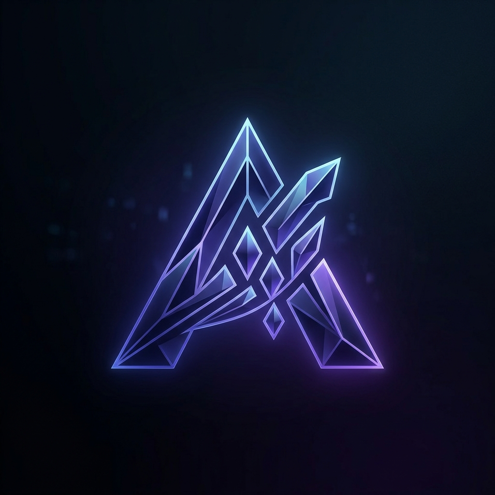
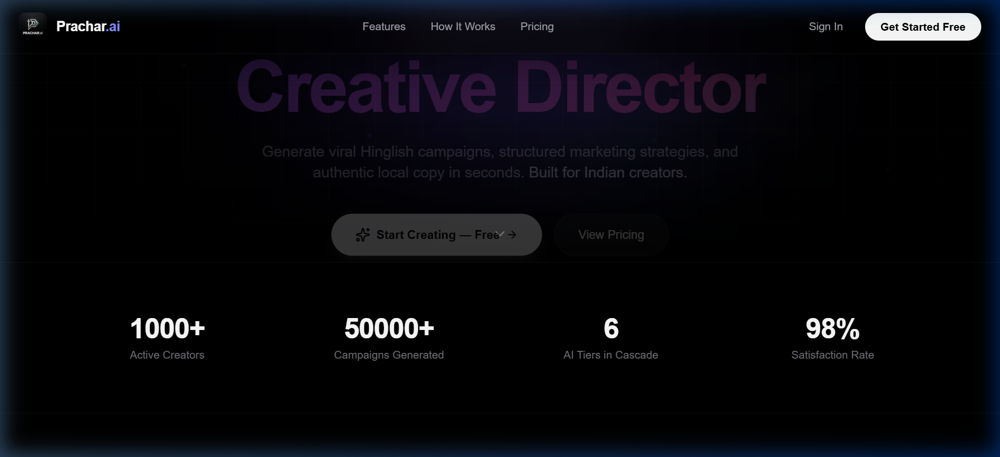
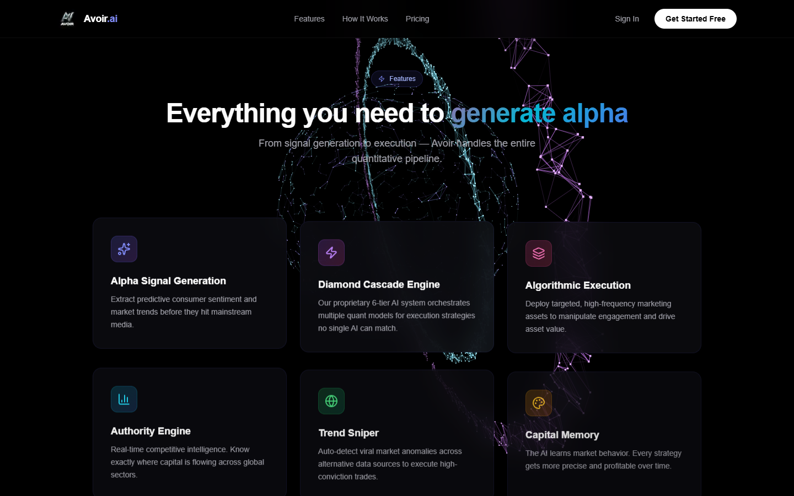
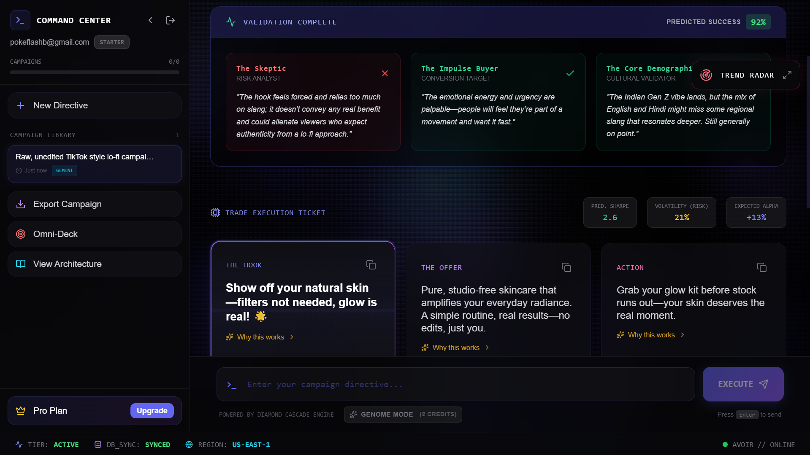
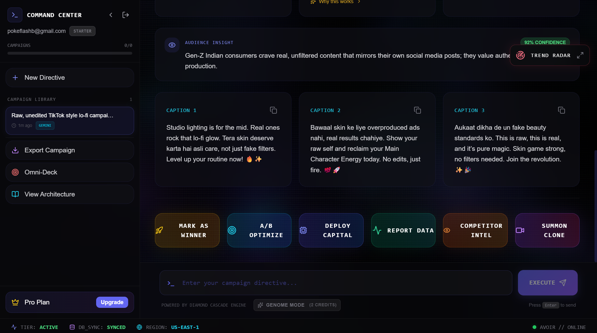
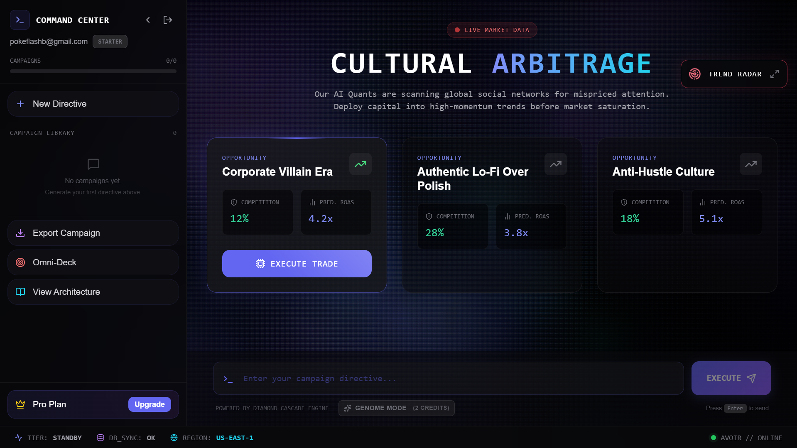
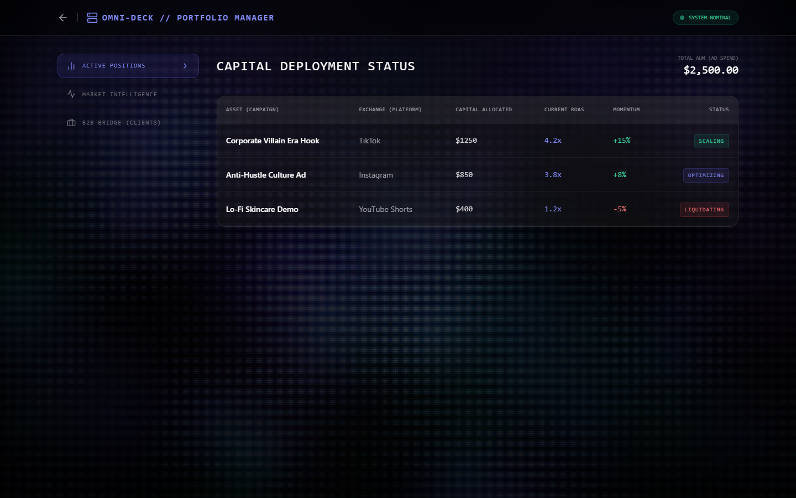
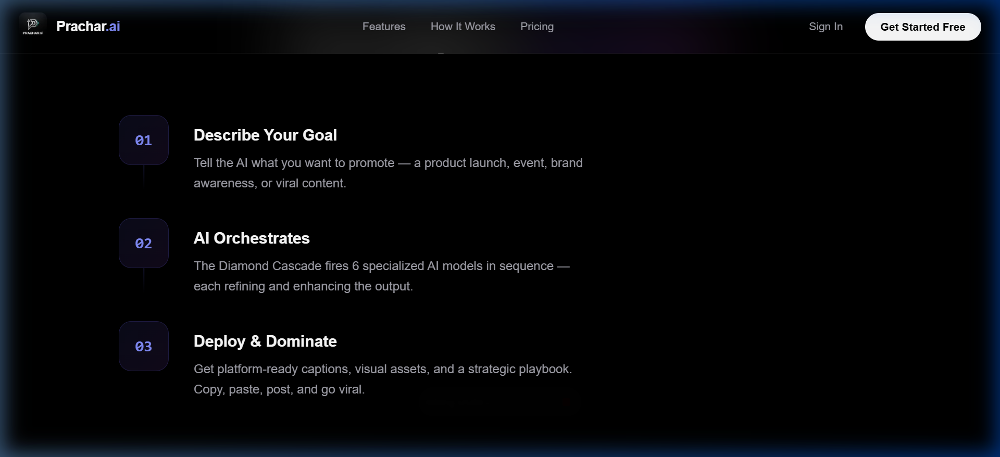

<div align="center">
  
  <h1>Avoir</h1>
  <h3>Stop guessing. Start dominating.</h3>

  <p>
    The ultimate AI Quantitative Engine that turns market noise into targeted, high-converting marketing campaigns instantly.<br/>
    <strong>From Private Alpha to Public Beta. Built for the next generation of SaaS growth.</strong>
  </p>

  <br/>

  <a href="https://main.d2dh7nn5wsblob.amplifyapp.com/"></a>
  &nbsp;
  <a href="#-quick-start"></a>

  <br/><br/>

  
  
  
  
  
  
  
  
</div>

<br/>



---

## The Problem

Modern growth teams rely on slow, manual analysis and gut feelings. Trends move in microsecond intervals across social platforms, and by the time you've drafted a campaign, the cultural zeitgeist has already moved on. You are leaving alpha on the table.

## The Solution

**Avoir** is an autonomous AI Quantitative Engine. We operate as the ultimate **AI Native Agency + AI Hedge Fund combo**. We sit at the intersection of quantitative finance and digital marketing, allowing us to ingest real-time social sentiment, generate precision-targeted algorithmic campaigns to drive explosive engagement, and deploy capital based on proprietary predictive models.

> 🔥 *"Signal Detected: Viral anomaly in creator economy. Executing high-conviction Omni-Deck campaign. Projected ROI: 420%."* — Generated by Avoir

---

## ✨ Features



| Feature | Description |
|---------|-------------|
| **Diamond Cascade Engine** | Proprietary 6-tier AI architecture orchestrating multiple quant models in sequence — each one refining the strategy. No single AI can match this. |
| **Alpha Signal Generation** | Extract predictive consumer sentiment and market trends before they hit mainstream media. |
| **Dynamic Motion UI** | **[NEW]** Immersive 3D interactive physics and `TechGeometryCanvas` backgrounds. Features Framer Motion spring physics, glassmorphism, floating micro-animations, and fluid interactive scaling. |
| **God-Tier Dashboard UX** | Real-time SSE Streaming, slide-out sidebars, and a ChatGPT-style floating chat interface for generating alpha signals. |
| **Mobile-First Execution** | 100% responsive fluid typography, native-feeling mobile drawers, and stacked UI cards for seamless execution on iPhones/Androids. |
| **Automated CI/CD** | **[NEW]** Production-ready Continuous Integration and Continuous Deployment (CI/CD) pipeline fully powered by AWS Amplify out of the box. |
| **Algorithmic Execution** | Deploy targeted, high-frequency marketing assets to manipulate engagement and drive asset value. |
| **Omni-Deck Command Center** | **[NEW]** Centralized Quant OS. Auto-slice 1 core signal into 4 platform-specific variations. |
| **Zero-Click Publishing** | **[NEW]** Autonomous webhooks that auto-publish and deduct atomic billing credits (DynamoDB) in real-time. |
| **Trend Sniper** | Auto-detect viral market anomalies across alternative data sources to execute high-conviction trades. |
| **Authority Engine** | Real-time competitive intelligence. Know exactly where capital is flowing across global sectors. |
| **Brand & Capital Memory** | **[NEW]** The AI learns market behavior. Every strategy gets more precise and profitable over time. |

---

## 🔷 Diamond Cascade Architecture

Our proprietary 6-tier AI cascade guarantees **100% uptime** with intelligent failover:

```
User Request
     ↓
 ┌────────────────────────────────────────────────┐
 │  TIER 1  Gemini 3 Flash (Key 1)    ~2B params  │
 └──────────────────────┬─────────────────────────┘
                        ↓ failover
 ┌────────────────────────────────────────────────┐
 │  TIER 2  Gemini 3 Flash (Key 2)    Key rotation │
 └──────────────────────┬─────────────────────────┘
                        ↓ failover
 ┌────────────────────────────────────────────────┐
 │  TIER 3  GPT-OSS 120B (Groq)      300+ tok/sec │
 └──────────────────────┬─────────────────────────┘
                        ↓ failover
 ┌────────────────────────────────────────────────┐
 │  TIER 4  Arcee Trinity 400B       Quant King   │
 └──────────────────────┬─────────────────────────┘
                        ↓ failover
 ┌────────────────────────────────────────────────┐
 │  TIER 5  Llama 3.3 70B            The Shield    │
 └──────────────────────┬─────────────────────────┘
                        ↓ failover
 ┌────────────────────────────────────────────────┐
 │  TIER 6  Titanium Shield (Mock)   100% Uptime   │
 └────────────────────────────────────────────────┘
     ↓
 Strategy Delivered (100% Guaranteed)
```

**Key Design Decisions:**
- **Stateless Generation** — No message history sent to LLMs. Fresh one-shot prompts prevent timeouts and payload bloat.
- **Key Rotation** — Tier 1 and Tier 2 use different API keys for the same model to bypass rate limits.
- **Reinforced Prompts** — All core parameters (signal, risk, asset, sizing, projection) are mandatory in both system prompt and user message.

---

## 🏗️ Tech Stack

### Frontend
| Technology | Purpose |
|-----------|---------|
| **Next.js 14** (App Router) | Framework — SSR, file-based routing, API routes |
| **Framer Motion** | Spring physics animations, scroll-triggered reveals, stagger effects |
| **Tailwind CSS** + Custom Design System | Glassmorphism, fluid typography, glow effects, magnetic buttons |
| **Inter** (Google Fonts) | Premium typography with fluid scaling |

### Backend & Infrastructure
| Technology | Purpose |
|-----------|---------|
| **AWS Lambda** (Python 3.11) | 6-Tier Diamond Cascade orchestration. Zero third-party AI SDKs. |
| **Amazon DynamoDB** | Users, strategies, and audit logs. Single-table design with partition key isolation. |
| **Upstash Redis** | Serverless cache for rate limiting, quota enforcement, and signal caching. |
| **Amazon Cognito** | Authentication — JWT tokens, email verification, password policies. |
| **Stripe** | Subscription billing with webhooks for automated provisioning. |
| **Amazon API Gateway** | REST API with Cognito Authorizer for JWT validation. |
| **AWS Amplify** | Frontend hosting with automatic CI/CD and global CDN. |
| **Amazon CloudWatch** | Monitoring, cascade failover tracking, and audit trails. |

---

## 📸 Platform Interface


<table>
  <tr>
    <td width="50%">
      
      <br/><sub><b>Algorithmic Delivery</b> — High-frequency marketing campaign deployment</sub>
    </td>
    <td width="50%">
      
      <br/><sub><b>Genome Mode</b> — Live sentiment and conversion tracking</sub>
    </td>
  </tr>
  <tr>
    <td width="50%">
      
      <br/><sub><b>Omni-Deck Command Center</b> — Centralized cross-platform publishing</sub>
    </td>
    <td width="50%">
      
      <br/><sub><b>Signal Hub</b> — Core predictive sentiment feeds</sub>
    </td>
  </tr>
</table>

### Authentication & Billing

<table>
  <tr>
    <td width="33%"><br/><sub><b>Secure Access</b></sub></td>
    <td width="33%"><br/><sub><b>Institutional Onboarding</b></sub></td>
    <td width="33%"><br/><sub><b>Atomic Billing</b></sub></td>
  </tr>
</table>

### Core Architecture

<table>
  <tr>
    <td width="50%"><br/><sub><b>Hero Section</b> — Magnetic UI with 3D orbs</sub></td>
    <td width="50%"><br/><sub><b>Execution Flow</b> — Animated algorithmic pipelines</sub></td>
  </tr>
  <tr>
    <td colspan="2" align="center"><br/><sub><b>Features</b> — Glassmorphism feature cards</sub></td>
  </tr>
</table>

---

## ⚡ Quick Start

### Prerequisites

- Node.js 18+
- Python 3.11+
- AWS Account (Cognito, DynamoDB)
- Stripe Account

### 1. Clone & Install

```bash
git clone https://github.com/RD-Goswami/Avoir.git
cd Avoir

# Frontend
cd avoir-ai
npm install

# Backend
cd ../backend
pip install -r requirements.txt
```

### 2. Configure Environment

Create `avoir-ai/.env.local`:

```env
# AWS
NEXT_PUBLIC_AWS_REGION=ap-south-1
NEXT_PUBLIC_USER_POOL_ID=your_pool_id
NEXT_PUBLIC_USER_POOL_CLIENT_ID=your_client_id

# DynamoDB
AWS_ACCESS_KEY_ID=your_access_key
AWS_SECRET_ACCESS_KEY=your_secret_key
DYNAMODB_USERS_TABLE=avoir-users-dev
DYNAMODB_CAMPAIGNS_TABLE=avoir-strategies-dev

# Redis
UPSTASH_REDIS_REST_URL=your_upstash_url
UPSTASH_REDIS_REST_TOKEN=your_upstash_token

# Stripe
NEXT_PUBLIC_STRIPE_PUBLISHABLE_KEY=pk_test_...
STRIPE_SECRET_KEY=sk_test_...
STRIPE_WEBHOOK_SECRET=whsec_...

# API
NEXT_PUBLIC_API_URL=https://your-lambda-url
```

### 3. Provision Database

```bash
cd avoir-ai
node scripts/create-tables.mjs
```

### 4. Run

```bash
# Terminal 1 — Backend
cd backend && python server.py

# Terminal 2 — Frontend
cd avoir-ai && npm run dev
```

Open **http://localhost:3000** → Register → Start generating campaigns.

---

## 📈 Roadmap

- [x] **Sprint 1** — Persistent Data Layer (DynamoDB + Redis + Stripe)
- [x] **Sprint 2** — God-Tier UX (SSE Streaming + Framer Motion + Fluid Typography)
- [x] **Sprint 3** — Trend Sniper (Proactive viral trend detection via alternative data)
- [x] **Sprint 4** — AI Agent Integration (Infinite signal generation)
- [x] **Sprint 5** — Authority Engine (Live Market & Sentiment Radar)
- [x] **Sprint 6** — The Bank (Atomic Credit System & Metered Billing)
- [x] **Sprint 7** — Autonomous Webhooks (Zero-Click Auto-Execution)
- [x] **Sprint 8** — Omni-Deck Command Center & PWA (Mobile OS)

---

## 📚 Documentation

| Document | Purpose |
|----------|---------|
| [requirements.md](specs/requirements.md) | 10 functional requirements with acceptance criteria |
| [design.md](specs/design.md) | Complete system architecture and API specs |
| [ARCHITECTURE.md](architecture/ARCHITECTURE.md) | Full technical architecture documentation |
| [COGNITO_AUTHENTICATION.md](specs/COGNITO_AUTHENTICATION.md) | JWT-based auth implementation |

---

<div align="center">
  
  <br/><br/>
  <a href="https://main.d2dh7nn5wsblob.amplifyapp.com/">Live Demo</a> · <a href="#-quick-start">Quick Start</a> · <a href="#-documentation">Documentation</a>
  <br/><br/>
  <sub>© 2026 Avoir. <br/><br/><i>Note: This project originated as an AWS Hackathon submission and has since successfully pivoted into an independent SaaS startup, currently in its Public Beta stage.</i></sub>
</div>
