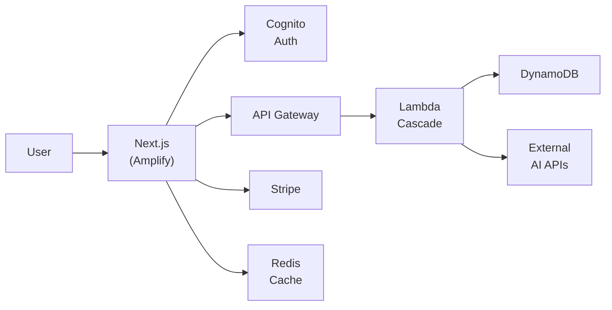
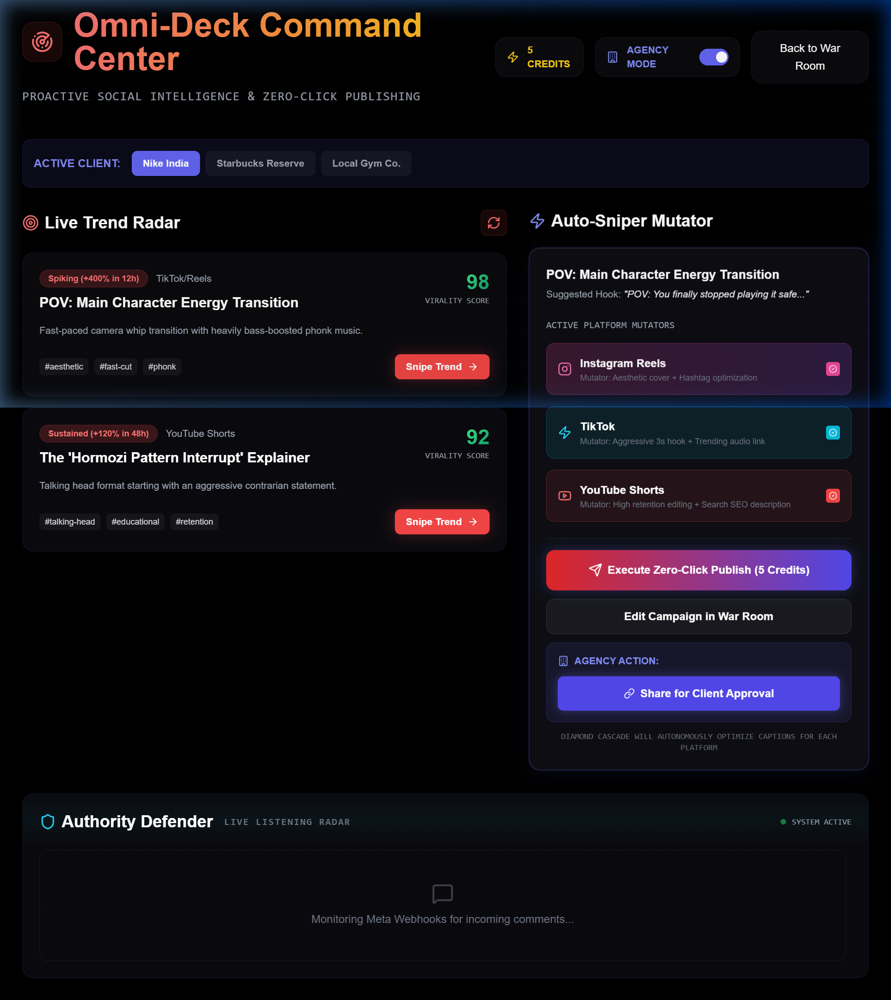
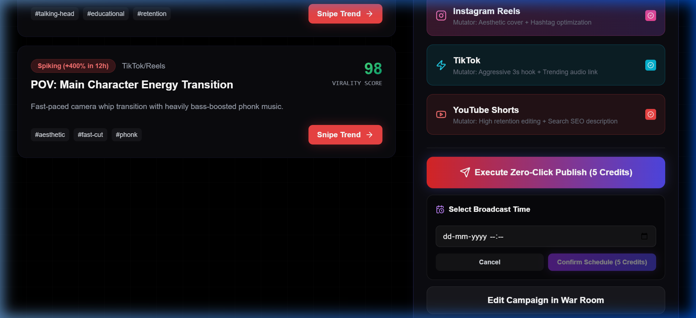

<div align="center">
  
  <h1>Prachar.ai</h1>
  <h3>The AI Creative Director for Modern Brands</h3>

  <p>
    Generate viral global campaigns, strategic marketing plans, and platform-ready content in seconds.<br/>
    <strong>Built for modern brands. Powered by a 6-Tier Diamond Cascade AI.</strong>
  </p>

  <br/>

  <a href="https://main.d2u0mm6cr1j81.amplifyapp.com/"></a>
  &nbsp;
  <a href="#-quick-start"></a>

  <br/><br/>

  
  
  
  
  
  
  
  
</div>

<br/>


---

## The Problem

Marketing requires a deep understanding of global pop culture and rapidly shifting social media trends. Existing AI tools generate generic, corporate-sounding copy that fails to connect with audiences. Creators and modern brands waste hours trying to craft content that resonates.

## The Solution

**Prachar.ai** is an autonomous AI Creative Director that generates complete, platform-ready marketing campaigns in authentic high-converting global copy — complete with viral hooks, strategic CTAs, and multi-platform captions. One click. Done.

> 🔥 *"Level up your digital presence! 3 days of intense workshops, hackathons, prizes. Main character energy? Register now!"* — Generated by Prachar.ai

---

## ✨ Features


| Feature | Description |
|---------|-------------|
| **Diamond Cascade Engine** | Proprietary 6-tier AI architecture orchestrating multiple models in sequence — each one refining the output. No single AI can match this. |
| **Global Mastery** | Generates viral copy with authentic power words (Aesthetic, Viral, Main Character Energy, Level Up) — not generic AI translations. |
| **Dynamic Motion UI** | **[NEW]** Immersive 3D interactive physics and `TechGeometryCanvas` backgrounds. Features Framer Motion spring physics, magnetic buttons, glassmorphism, floating micro-animations, and fluid interactive scaling that reacts to mouse tracking. |
| **God-Tier Dashboard UX** | Real-time SSE Streaming, slide-out sidebars, and a ChatGPT-style floating chat interface for generating campaigns. |
| **Mobile-First Domination** | 100% responsive fluid typography, native-feeling mobile drawers, and stacked UI cards for seamless execution on iPhones/Androids. |
| **Automated CI/CD** | **[NEW]** Production-ready Continuous Integration and Continuous Deployment (CI/CD) pipeline fully powered by AWS Amplify out of the box. |
| **Complete Campaigns** | Hook → Offer → CTA strategy + 3 platform-ready captions + visual direction. Everything in one click. |
| **Omni-Deck Command Center** | **[NEW]** Centralized Marketing OS. Auto-slice 1 core asset into 4 platform-specific variations (e.g., TikTok hooks, Insta aesthetics). |
| **Zero-Click Publishing** | **[NEW]** Autonomous webhooks that auto-publish and deduct atomic billing credits (DynamoDB) in real-time. |
| **Trend Sniper** | Auto-detect viral trends across platforms and execute "Snipe Trend" hijacking autonomously. |
| **Authority Defender** | Live engagement radar that monitors Meta webhooks for incoming comments and deploys AI to auto-manage trolls and fans universally. |
| **Mobile PWA OS** | **[NEW]** Progressive Web App architecture for native iOS/Android installation with dynamic "Schedule for Later" queues. |

---

## 🔷 Diamond Cascade Architecture

Our proprietary 6-tier AI cascade guarantees **100% uptime** with intelligent failover:

```
User Request
     ↓
 ┌────────────────────────────────────────────────┐
 │  TIER 1  Gemini 3 Flash (Key 1)    ~2B params  │
 └──────────────────────┬─────────────────────────┘
                        ↓ failover
 ┌────────────────────────────────────────────────┐
 │  TIER 2  Gemini 3 Flash (Key 2)    Key rotation │
 └──────────────────────┬─────────────────────────┘
                        ↓ failover
 ┌────────────────────────────────────────────────┐
 │  TIER 3  GPT-OSS 120B (Groq)      300+ tok/sec │
 └──────────────────────┬─────────────────────────┘
                        ↓ failover
 ┌────────────────────────────────────────────────┐
 │  TIER 4  Arcee Trinity 400B       Creative King │
 └──────────────────────┬─────────────────────────┘
                        ↓ failover
 ┌────────────────────────────────────────────────┐
 │  TIER 5  Llama 3.3 70B            The Shield    │
 └──────────────────────┬─────────────────────────┘
                        ↓ failover
 ┌────────────────────────────────────────────────┐
 │  TIER 6  Titanium Shield (Mock)   100% Uptime   │
 └────────────────────────────────────────────────┘
     ↓
 Campaign Delivered (100% Guaranteed)
```

**Key Design Decisions:**
- **Stateless Generation** — No message history sent to LLMs. Fresh one-shot prompts prevent timeouts and payload bloat.
- **Key Rotation** — Tier 1 and Tier 2 use different API keys for the same model to bypass rate limits.
- **Reinforced Prompts** — All 5 campaign keys (hook, offer, cta, captions, image_prompt) are mandatory in both system prompt and user message.

---

## 🏗️ Tech Stack

### Frontend
| Technology | Purpose |
|-----------|---------|
| **Next.js 14** (App Router) | Framework — SSR, file-based routing, API routes |
| **Framer Motion** | Spring physics animations, scroll-triggered reveals, stagger effects |
| **Tailwind CSS** + Custom Design System | Glassmorphism, fluid typography, glow effects, magnetic buttons |
| **Inter** (Google Fonts) | Premium typography with fluid scaling |

### Backend & Infrastructure
| Technology | Purpose |
|-----------|---------|
| **AWS Lambda** (Python 3.11) | 6-Tier Diamond Cascade orchestration. Zero third-party AI SDKs. |
| **Amazon DynamoDB** | Users, campaigns, and audit logs. Single-table design with partition key isolation. |
| **Upstash Redis** | Serverless cache for rate limiting, quota enforcement, and campaign caching. |
| **Amazon Cognito** | Authentication — JWT tokens, email verification, password policies. |
| **Stripe** | Subscription billing with webhooks for automated provisioning. |
| **Amazon API Gateway** | REST API with Cognito Authorizer for JWT validation. |
| **AWS Amplify** | Frontend hosting with automatic CI/CD and global CDN. |
| **Amazon CloudWatch** | Monitoring, cascade failover tracking, and audit trails. |

### Architecture Diagram



---

## 📸 Screenshots

<table>
  <tr>
    <td width="50%"><br/><sub><b>Landing Page</b> — Parallax hero with floating gradient orbs</sub></td>
    <td width="50%"><br/><sub><b>Pricing</b> — Glassmorphism cards with animated toggle</sub></td>
  </tr>
  <tr>
    <td width="50%"><br/><sub><b>War Room</b> — God-tier Generation UI</sub></td>
    <td width="50%"><br/><sub><b>Omni-Deck</b> — Zero-Click Publishing & Live Radar</sub></td>
  </tr>
  <tr>
    <td width="50%"><br/><sub><b>Mobile OS & Scheduling</b> — Omnichannel Campaign Queues</sub></td>
    <td width="50%"><br/><sub><b>How It Works</b> — Three-step flow with spring animations</sub></td>
  </tr>
</table>

---

## ⚡ Quick Start

### Prerequisites

- Node.js 18+
- Python 3.11+
- AWS Account (Cognito, DynamoDB)
- Stripe Account

### 1. Clone & Install

```bash
git clone https://github.com/RD-Goswami/Prachar.ai.git
cd Prachar.ai

# Frontend
cd prachar-ai
npm install

# Backend
cd ../backend
pip install -r requirements.txt
```

### 2. Configure Environment

Create `prachar-ai/.env.local`:

```env
# AWS
NEXT_PUBLIC_AWS_REGION=ap-south-1
NEXT_PUBLIC_USER_POOL_ID=your_pool_id
NEXT_PUBLIC_USER_POOL_CLIENT_ID=your_client_id

# DynamoDB
AWS_ACCESS_KEY_ID=your_access_key
AWS_SECRET_ACCESS_KEY=your_secret_key
DYNAMODB_USERS_TABLE=prachar-users-dev
DYNAMODB_CAMPAIGNS_TABLE=prachar-campaigns-dev

# Redis
UPSTASH_REDIS_REST_URL=your_upstash_url
UPSTASH_REDIS_REST_TOKEN=your_upstash_token

# Stripe
NEXT_PUBLIC_STRIPE_PUBLISHABLE_KEY=pk_test_...
STRIPE_SECRET_KEY=sk_test_...
STRIPE_WEBHOOK_SECRET=whsec_...

# API
NEXT_PUBLIC_API_URL=https://your-lambda-url
```

### 3. Provision Database

```bash
cd prachar-ai
node scripts/create-tables.mjs
```

### 4. Run

```bash
# Terminal 1 — Backend
cd backend && python server.py

# Terminal 2 — Frontend
cd prachar-ai && npm run dev
```

Open **http://localhost:3000** → Register → Start generating campaigns.

### Production Deployment

```bash
# Deploy Lambda
cd backend && ./build_lambda.sh
aws lambda update-function-code \
  --function-name prachar-ai-backend \
  --zip-file fileb://prachar-production-backend.zip

# Deploy Frontend (auto-deploys on push)
git push origin main
```

**Live Demo:** [https://main.d2u0mm6cr1j81.amplifyapp.com/](https://main.d2u0mm6cr1j81.amplifyapp.com/)

---

## 📈 Roadmap

- [x] **Sprint 1** — Persistent Data Layer (DynamoDB + Redis + Stripe)
- [x] **Sprint 2** — God-Tier UX (SSE Streaming + Framer Motion + Fluid Typography)
- [x] **Sprint 3** — Trend Sniper (Proactive viral trend detection via Instagram/X APIs)
- [x] **Sprint 4** — Shadow Clone (Infinite content generation + AI avatar integration)
- [x] **Sprint 5** — Authority Defender (Live Comment & Engagement Radar)
- [x] **Sprint 6** — The Bank (Atomic Credit System & Metered Billing)
- [x] **Sprint 7** — Autonomous Webhooks (Zero-Click Auto-Publish & Deduction)
- [x] **Sprint 8** — Omni-Deck Command Center & PWA (Scheduling & Mobile OS)

---

## 📚 Documentation

| Document | Purpose |
|----------|---------|
| [requirements.md](specs/requirements.md) | 10 functional requirements with acceptance criteria |
| [design.md](specs/design.md) | Complete system architecture and API specs |
| [ARCHITECTURE.md](architecture/ARCHITECTURE.md) | Full technical architecture documentation |
| [COGNITO_AUTHENTICATION.md](specs/COGNITO_AUTHENTICATION.md) | JWT-based auth implementation |

---

## 👥 Team NEONX

<table>
  <tr>
    <td align="center">
      <a href="https://github.com/SxBxcoder">
        
        <br />
        <sub><b>Sayandip Bhattacharya</b></sub>
      </a>
      <br />
      <sub>Lead Developer — Architecture, Backend, AI, Frontend</sub>
    </td>
    <td align="center">
      <a href="https://github.com/RD-Goswami">
        
        <br />
        <sub><b>Radhadipto Goswami</b></sub>
      </a>
      <br />
      <sub>Presentation Lead — PPT, Documentation</sub>
    </td>
    <td align="center">
      <a href="https://github.com/Sourashis-Chatterjee">
        
        <br />
        <sub><b>Sourashis Chatterjee</b></sub>
      </a>
      <br />
      <sub>Technical Developer — Content, Demo Preparation</sub>
    </td>
  </tr>
</table>

---

## 🏅 Built For

**AWS "AI for Bharat" Hackathon** — Student Track: Media, Content & Creativity

**8 AWS Services:** Lambda · Cognito · DynamoDB · S3 · API Gateway · CloudWatch · Amplify · Redis (Upstash)

---

<div align="center">
  
  <br/><br/>
  <a href="https://main.d2u0mm6cr1j81.amplifyapp.com/">Live Demo</a> · <a href="#-quick-start">Quick Start</a> · <a href="#-documentation">Documentation</a>
  <br/><br/>
  <sub>© 2026 Team NEONX</sub>
</div>

