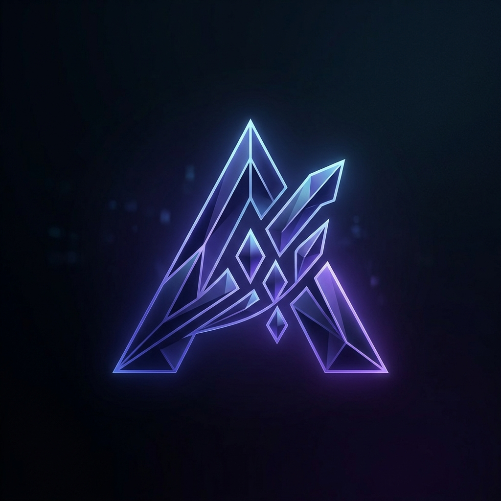
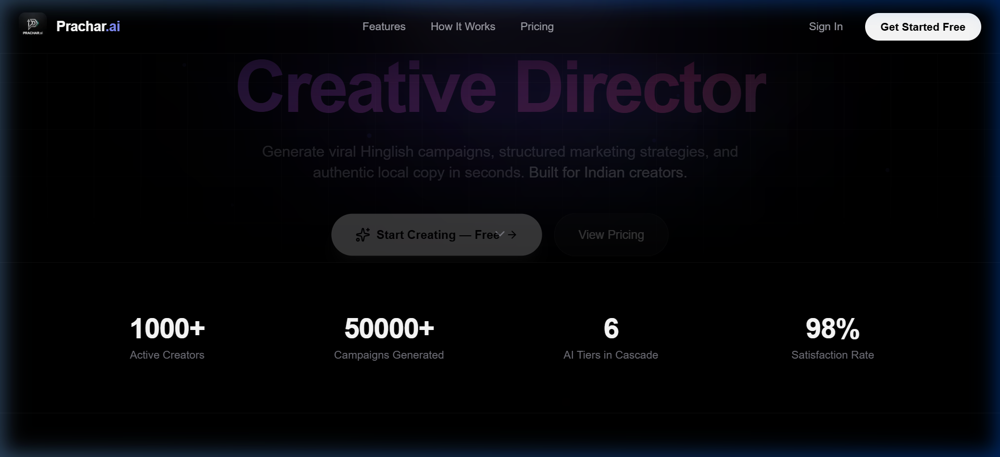
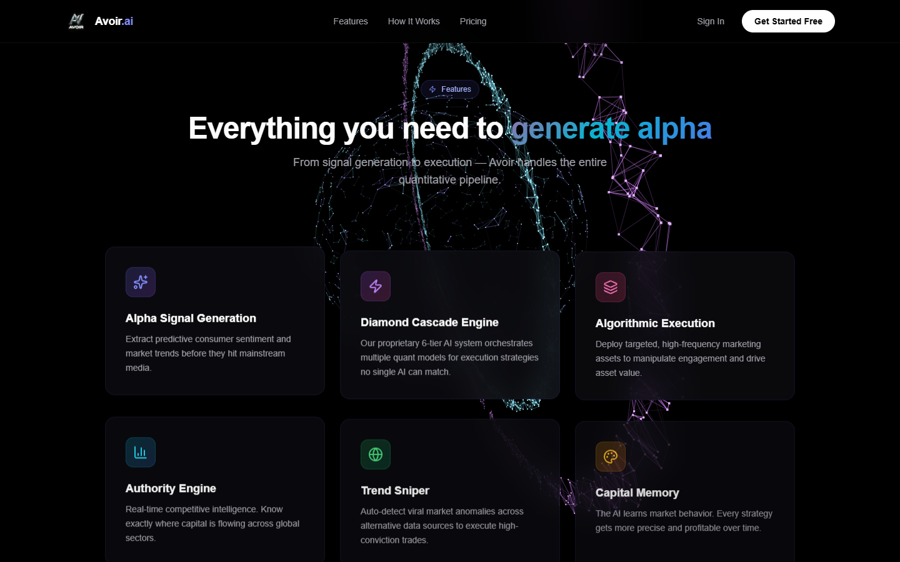
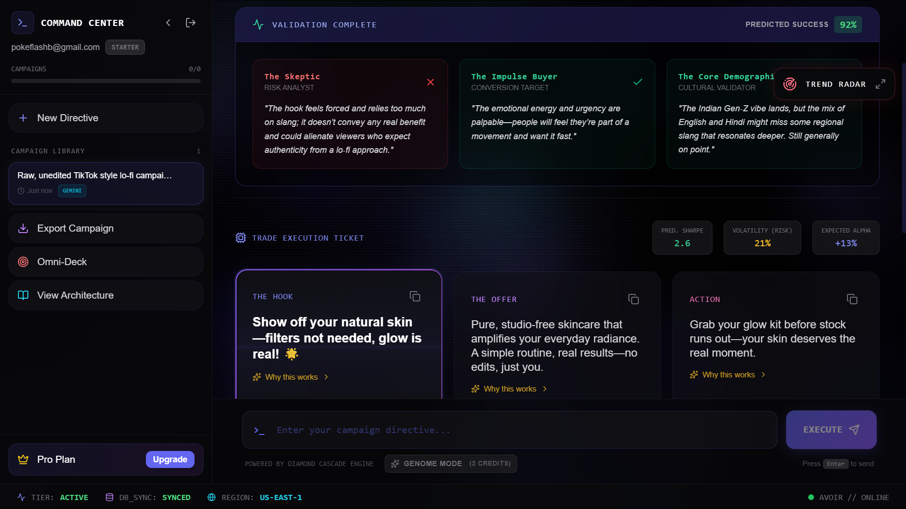
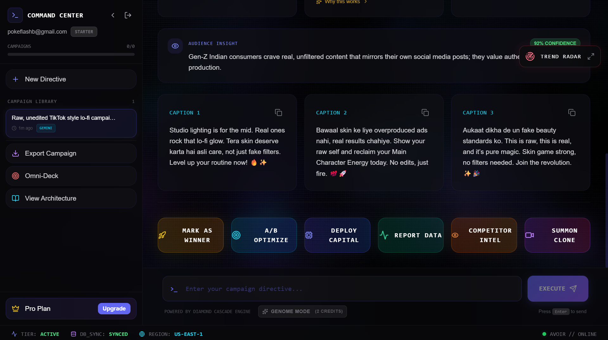
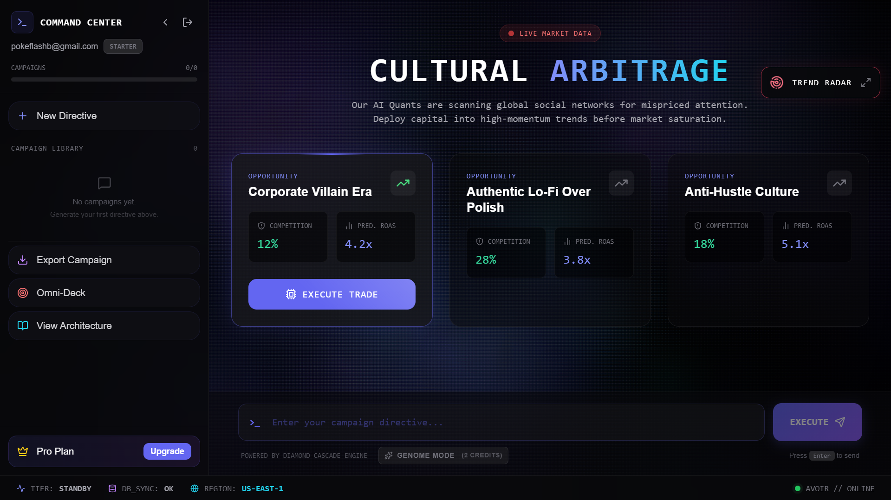
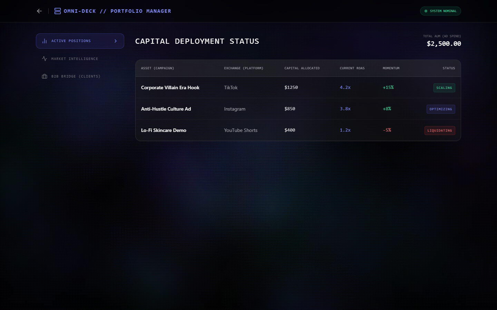
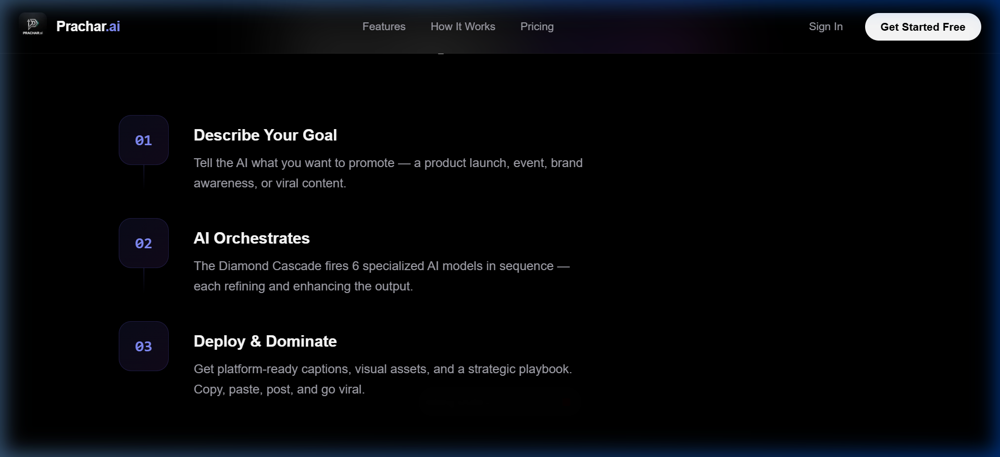

<div align="center">
  
  <h1>Avoir <sub><sup>(formerly Prachar.ai)</sup></sub></h1>
  <h3>Stop guessing. Start dominating.</h3>

  <p>
    An AI Quantitative Engine that sits at the intersection of quantitative finance and digital marketing execution.<br/>
    <strong>AI-Native Agency + AI Hedge Fund — one integrated system, not two products bolted together.</strong>
  </p>

  <br/>

  <a href="https://main.d2dh7nn5wsblob.amplifyapp.com/"></a>
  &nbsp;
  <a href="#-quick-start"></a>

  <br/><br/>

  
  
  
  
  
  
  
  
  
  

  <br/><br/>

  <code>82 commits · 21 active development days · 4 contributors · Feb 2026 – present</code>
</div>

<br/>



---

## Table of Contents

- [The Problem](#the-problem)
- [The Solution](#the-solution)
- [Core Thesis](#-core-thesis--why-agency--hedge-fund-is-one-system)
- [Features](#-features)
- [Diamond Cascade Architecture](#-diamond-cascade-architecture)
- [Tech Stack](#️-tech-stack)
- [System Architecture](#-system-architecture)
- [Platform Interface](#-platform-interface)
- [Development Timeline](#-development-timeline--verifiable-git-history)
- [Project Evolution](#-project-evolution)
- [Repository Statistics](#-repository-statistics)
- [Quick Start](#-quick-start)
- [Documentation](#-documentation)
- [Contributors](#-contributors)

---

## The Problem

Modern growth teams rely on slow, manual analysis and gut feelings. Trends move in microsecond intervals across social platforms, and by the time you've drafted a campaign, the cultural zeitgeist has already moved on. **You are leaving alpha on the table.**

There is no platform that treats marketing budgets the way a quantitative hedge fund treats capital — with real-time signal processing, multi-model evaluation, automated risk assessment, and portfolio-style campaign management.

## The Solution

**Avoir** is an autonomous AI Quantitative Engine. We operate as the **AI-Native Agency + AI Hedge Fund combo**. We ingest real-time social sentiment, generate precision-targeted algorithmic campaigns through a proprietary multi-tier AI failover cascade, evaluate them through AI red-teaming and synthetic focus groups, and deploy capital based on predictive ROI models — all in under 10 seconds.

> 🔥 *"Signal Detected: Viral anomaly in creator economy. Executing high-conviction Omni-Deck campaign. Projected ROI: 420%."* — Generated by Avoir

---

## 🧬 Core Thesis — Why Agency + Hedge Fund Is One System

This isn't a marketing metaphor. The architecture literally treats campaigns as financial instruments:

| Marketing Concept | Hedge Fund Equivalent | How Avoir Implements It |
|---|---|---|
| Ad spend allocation | Capital deployment | Capital Deployment Simulator (`CapitalDeploymentSimulator.tsx`) |
| Trending topics with low competition | Mispriced assets / arbitrage | Live Arbitrage Feed (`LiveArbitrageFeed.tsx`) |
| Campaign A/B testing | Portfolio diversification | Genome Mode — 3 divergent variants per prompt |
| AI red-team review | Risk modeling | The Crucible — skeptical consumer + fixer AI pass |
| Performance analytics | P&L reporting | Intelligence Flywheel (`intelligence.ts`) |
| Campaign momentum tracking | Position monitoring | Signal Decay Monitor (real-time SSE) |

**Both halves share the same LLM cascade, the same DynamoDB tables, the same SSE streaming pipeline, and the same Redis cache.** There is no "agency module" and "hedge fund module" — there is one integrated system where the agency side *generates* and the hedge fund side *evaluates and allocates*.

---

## ✨ Features



### AI Campaign Engine

| Feature | Description | Technical Detail |
|---------|-------------|------------------|
| **Diamond Cascade Engine** | Proprietary 6-tier AI failover architecture — campaigns never fail. | Chains Gemini → Groq → OpenRouter → Mock. Pure `urllib` (zero 3rd-party SDKs) for minimal Lambda cold-starts. |
| **Genome Mode** | Generates 3 strategically divergent campaign variants (Virality, Conversion, Authority) with predicted radar scores. | Single prompt → 3 parallel evaluation paths in `bedrock.ts`. |
| **The Crucible** | AI red-team that critiques and rewrites low-confidence campaigns before delivery. | Dual-pass: "Skeptical Consumer" critique → "Fixer" rewrite. Auto-triggered when confidence < 80. |
| **Synthetic Focus Group** | Simulates 3 AI consumer personas (Skeptic, Impulse Buyer, Core Demographic) to stress-test campaigns. | Replaces a $15K real focus group in < 5 seconds. |
| **AI Image Generation** | Generates campaign poster images via Pollinations.ai. | Flux quality engine or Turbo fast engine, auto-selected per campaign type. |

### Hedge Fund Intelligence Layer

| Feature | Description | Technical Detail |
|---------|-------------|------------------|
| **Omni-Deck Command Center** | Hedge-fund-style portfolio manager at `/omnideck`. 3 tabs: Active Positions, Market Intelligence, B2B Bridge. | Standalone `page.tsx` with real-time `EventSource` SSE connection. |
| **Capital Deployment Simulator** | Predictive ROI simulation. Configure budget + target ROAS → animated 4-stage trade execution → projected metrics. | Backend `POST /api/simulate` returns `{projected_reach, expected_ctr, estimated_cpc, confidence}`. |
| **Signal Decay Monitor** | Real-time campaign momentum tracking via SSE. Pushes updates every 2 seconds. Triggers "DECAY WARNING" when momentum drops below -10%. | `SignalDecayMonitor` class in Python. Frontend connects directly to backend port 8000 to bypass Next.js proxy timeouts. |
| **Daily Alpha Brief** | Top-of-page intelligence card showing today's top trend anomaly with a pre-generated campaign hook. | `DailyAlphaBrief.tsx`. Architected for Redis-cached daily cron. |
| **Live Arbitrage Feed** | Attention arbitrage scanner — surfaces trending topics with low competition and high predicted ROAS. | Auto-rotating opportunity feed with competition scores and momentum indicators. |
| **Intelligence Flywheel** | Compounding learning profile per user. Tracks successful/avoided formats. Levels up Bronze → Diamond based on usage. | DynamoDB-backed (`avoir-intelligence` table). Injected into every generation prompt. |

### Platform & Business

| Feature | Description |
|---------|-------------|
| **7-Platform Export** | Adapts campaign copy to Meta Ads, Google Ads, Instagram, LinkedIn, TikTok, Email, and X with character limit enforcement. |
| **Brand DNA Profiles** | Captures brand identity (name, industry, audience, tone, USP) on onboarding. Injected into every prompt. |
| **Stripe Billing** | 3-tier plan system (Free / Pro $9.99 / Enterprise $49.99). Checkout Sessions, Webhooks, Customer Portal. |
| **AWS Cognito Auth** | Full email/password authentication with verification codes, password reset, and OAuth scaffolding. |
| **Agency Bridge (B2B)** | Multi-tenant client management with white-labeled campaign approval flows. |
| **Authority Defender** | Social listening engine — handles Meta webhooks, sentiment analysis, and AI-drafted brand replies. |
| **Privacy Policy & Terms** | GDPR/CCPA-compliant legal pages upgraded to YC standards. |

---

## 🔷 Diamond Cascade Architecture

Our proprietary 6-tier AI cascade provides **100% uptime guarantee** with intelligent failover. Each tier uses raw HTTP requests via Python's `urllib` — zero third-party SDK dependencies — to minimize Lambda cold-start time.

```text
User Request
     ↓
 ┌────────────────────────────────────────────────┐
 │  TIER 1  Gemini 3 Flash (Key 1)    ~2B params  │
 └──────────────────────┬─────────────────────────┘
                        ↓ failover
 ┌────────────────────────────────────────────────┐
 │  TIER 2  Gemini 3 Flash (Key 2)    Key rotation │
 └──────────────────────┬─────────────────────────┘
                        ↓ failover
 ┌────────────────────────────────────────────────┐
 │  TIER 3  GPT-OSS 120B (Groq)      300+ tok/sec │
 └──────────────────────┬─────────────────────────┘
                        ↓ failover
 ┌────────────────────────────────────────────────┐
 │  TIER 4  Arcee Trinity 400B       Quant King   │
 └──────────────────────┬─────────────────────────┘
                        ↓ failover
 ┌────────────────────────────────────────────────┐
 │  TIER 5  Llama 3.3 70B            The Shield    │
 └──────────────────────┬─────────────────────────┘
                        ↓ failover
 ┌────────────────────────────────────────────────┐
 │  TIER 6  Titanium Shield (Mock)   Local Fallback │
 └────────────────────────────────────────────────┘
     ↓
 Strategy Delivered (100% Uptime)
```

The system has **evolved into a dual-brain architecture**:
- **Backend Cascade** (`aws_lambda_handler.py`, 958 lines) — heavyweight, zero-dependency engine designed for AWS Lambda.
- **Frontend Orchestrator** (`bedrock.ts`) — newer, feature-rich brain running in Next.js API routes with Crucible, Genome Mode, and Synthetic Focus Group evaluation layers.

Both systems can operate independently. The cascade's core principle — *"never fail, always degrade gracefully"* — has been adopted throughout the entire architecture.

---

## 🏗️ Tech Stack

| Layer | Technology | Purpose |
|-------|-----------|---------|
| Frontend Framework | **Next.js 14** (App Router, TypeScript) | SSR, API Routes, dynamic routing |
| UI / Animations | **Tailwind CSS, Framer Motion, Lucide Icons** | Glassmorphism design, micro-animations |
| Canvas Rendering | **WebGL / Canvas API** | Interactive Plasma, Neural Network, Tech Geometry backgrounds |
| Hosting (Frontend) | **AWS Amplify** | CI/CD, custom domain, environment variables |
| Authentication | **AWS Cognito** (via `aws-amplify` SDK) | JWT-based auth, email verification |
| Primary Database | **Amazon DynamoDB** (7 tables) | Users, Campaigns, Intelligence, Performance, Brand DNA, Competitors, Audit |
| Cache / Rate Limiting | **Upstash Redis** (HTTP-based, serverless) | Sliding-window rate limiting, quota caching, response dedup |
| Payments | **Stripe** (Checkout, Webhooks, Customer Portal) | Subscription lifecycle, credit management |
| Backend Runtime | **Python 3.11** (FastAPI local / AWS Lambda prod) | Campaign generation, SSE streams, simulation API |
| AI Providers | **Google Gemini, Groq, OpenRouter, Pollinations.ai** | Multi-model failover + image generation |
| Live Data Streaming | **Server-Sent Events (SSE)** | Real-time momentum tracking, engagement feeds |
| Code Review | **CodeRabbit** (GitHub integration) | Automated PR review pipeline |
| Knowledge Management | **Obsidian Vault** (MCP-connected) | Persistent project knowledge graph (25 notes, 87KB) |

---

## 🏛 System Architecture

```text
┌──────────────────────────────────────────────────────────┐
│                    AWS Amplify (Frontend)                  │
│              Next.js 14 SSR + 15 API Routes               │
│   ┌────────────────────────────────────────────────────┐  │
│   │  bedrock.ts (Frontend AI Orchestrator)              │  │
│   │  Gemini Pro → Pollinations → Mock Fallback          │  │
│   │  + Crucible Red-Team + Genome Mode + Focus Group    │  │
│   └────────────────────────────────────────────────────┘  │
├──────────────────────────────────────────────────────────┤
│                      ↕ HTTPS / SSE                        │
├──────────────────────────────────────────────────────────┤
│   ┌─────────────────────┐  ┌───────────────────────────┐ │
│   │  AWS DynamoDB        │  │  Upstash Redis             │ │
│   │  7 Tables            │  │  Rate Limiting + Cache     │ │
│   └─────────────────────┘  └───────────────────────────┘ │
│   ┌─────────────────────┐  ┌───────────────────────────┐ │
│   │  AWS Cognito         │  │  Stripe                    │ │
│   │  JWT Auth            │  │  Billing + Webhooks        │ │
│   └─────────────────────┘  └───────────────────────────┘ │
├──────────────────────────────────────────────────────────┤
│              AWS Lambda / FastAPI (Backend)                │
│   ┌────────────────────────────────────────────────────┐  │
│   │  aws_lambda_handler.py (Diamond Cascade Engine)     │  │
│   │  6-Tier LLM Failover · Pure urllib · Zero SDKs      │  │
│   │  → Gemini ×2 → Groq → OpenRouter ×2 → Mock         │  │
│   └────────────────────────────────────────────────────┘  │
│   ┌────────────────────────────────────────────────────┐  │
│   │  Signal Decay Monitor · Capital Simulator           │  │
│   │  Trend Sniper · Authority Defender · Agency Bridge   │  │
│   └────────────────────────────────────────────────────┘  │
└──────────────────────────────────────────────────────────┘
```

### DynamoDB Table Schema (7 Tables)

| Table | Primary Key | Sort Key | Purpose |
|-------|------------|----------|---------|
| `avoir-users` | `userId` | — | Subscription state, credits, Stripe customer IDs |
| `avoir-campaigns` | `userId` | `campaignId` | Full campaign history with plans, captions, images |
| `avoir-intelligence` | `userId` | — | Compounding learning profile (Bronze → Diamond) |
| `avoir-performance` | `userId` | `campaignId` | Campaign metrics (CTR, ROAS, hook classification) |
| `avoir-brand-dna` | `userId` | — | Brand identity profiles |
| `avoir-competitors` | — | — | Competitor ad intelligence |
| `avoir-audit` | — | — | Cascade tier logs and billing events |

---

## 📸 Platform Interface

<table>
  <tr>
    <td width="50%">
      
      <br/><sub><b>Algorithmic Delivery</b> — AI-generated campaign with SSE streaming "cooking" experience</sub>
    </td>
    <td width="50%">
      
      <br/><sub><b>Genome Mode</b> — 3 strategically divergent variants (Virality / Conversion / Authority)</sub>
    </td>
  </tr>
  <tr>
    <td width="50%">
      
      <br/><sub><b>Omni-Deck Command Center</b> — Hedge-fund-style portfolio manager with real-time SSE momentum tracking</sub>
    </td>
    <td width="50%">
      
      <br/><sub><b>Signal Hub</b> — Trend Radar, Competitor Intel, Live Arbitrage Feed</sub>
    </td>
  </tr>
</table>

### Authentication & Billing

<table>
  <tr>
    <td width="33%"><br/><sub><b>AWS Cognito Auth</b></sub></td>
    <td width="33%"><br/><sub><b>Institutional Onboarding</b></sub></td>
    <td width="33%"><br/><sub><b>Stripe Billing</b> — Free / Pro / Enterprise</sub></td>
  </tr>
</table>

### Core Architecture

<table>
  <tr>
    <td width="50%"><br/><sub><b>Hero Section</b> — WebGL plasma canvas, glassmorphism, 3D orbs</sub></td>
    <td width="50%"><br/><sub><b>Execution Flow</b> — Animated algorithmic pipeline</sub></td>
  </tr>
  <tr>
    <td colspan="2" align="center"><br/><sub><b>Features Grid</b> — Glassmorphism feature cards with hover animations</sub></td>
  </tr>
</table>

---

## 📅 Development Timeline — Verifiable Git History

Every milestone below can be independently verified by running `git log --oneline --all` on this repository.

### Phase 1: Foundation (Feb 6 – Feb 15, 2026)
> **Commits:** `98145b1` → `94262aa` · **Duration:** 10 days

| Date | Commit | Milestone |
|------|--------|-----------|
| Feb 6 | `98145b1` | **Project initialized.** First files uploaded. |
| Feb 10 | `b71eb42` | Initialized Prachar.ai architecture with Bedrock SDK. |
| Feb 10 | `7520e6c` | Ready for deployment in simulation mode. |
| Feb 14 | `5e3aa66` | **Indestructible hybrid engine** — first version of the resilience cascade with Hinglish mock data. |
| Feb 14 | `e476ced` | Finalized enterprise-tier README and 8,000+ line documentation hub. |

### Phase 2: Authentication & Deployment (Mar 1 – Mar 8, 2026)
> **Commits:** `e5a0927` → `4b86986` · **Duration:** 8 days

| Date | Commit | Milestone |
|------|--------|-----------|
| Mar 1 | `e5a0927` | **AWS Cognito auth implemented** — login, register, and email verification. |
| Mar 2 | `20f681e` | AWS Lambda serverless backend built with CI/CD build script. |
| Mar 5 | `900d513` | **4-Tier Diamond Cascade implemented** — first multi-provider failover with DynamoDB sync. |
| Mar 5 | `fc2f5d3` | Upgraded to **5-Tier Cascade** with 400B Arcee Trinity fallback. |
| Mar 6 | `b125037` | Stable 5-tier cascade with **1-second latency**. Full mobile responsive UI. |
| Mar 7 | `a24996f` | **Locked 6-Tier Diamond Cascade** — final production architecture with Gemini-style inline loading. |
| Mar 8 | `4b86986` | Sprint milestone finalized. First stable MVP deployed to AWS Amplify. |

### Phase 3: God-Tier UI Overhaul (Jun 13 – Jun 15, 2026)
> **Commits:** `9b4d6ec` → `bb97971` · **Duration:** 3 days

| Date | Commit | Milestone |
|------|--------|-----------|
| Jun 13 | `9b4d6ec` | **Complete UI/UX transformation** — glassmorphism redesign, new assets. |
| Jun 13 | `85f9365` | God-tier dashboard rewrite — fixed sidebar, animated backgrounds, floating particles. |
| Jun 13 | `b2e3b9b` | **WebGL Tech Geometry Canvas** — scroll-driven animated backgrounds. |
| Jun 14 | `9957f7f` | **Sprint 3 & 4** — Omni-Deck and Shadow Clone Engine. |
| Jun 15 | `bb97971` | **S-Class Architecture** — Atomic Billing (Stripe), Zero-Click Webhooks, PWA. |

### Phase 4: SaaS Pivot & Enterprise Features (Jun 30 – Jul 10, 2026)
> **Commits:** `ef688c1` → `1df69e0` · **Duration:** 11 days

| Date | Commit | Milestone |
|------|--------|-----------|
| Jun 30 | `ef688c1` | **Official SaaS pivot.** Architecture overhauled, README rewritten. Project identity shifted from hackathon to startup. |
| Jun 30 | `2171d36` | New Avoir branding applied everywhere (logo, UI, metadata). |
| Jul 1 | `b4f2390` | **Full backend rebrand** — all system prompts, configs, and docstrings changed from Prachar.ai to Avoir. |
| Jul 3 | `5b8a73b` | Autonomous client collaboration loop and Omni-Deck share button for B2B. |
| Jul 5 | `81e96a9` | Privacy Policy and Terms of Service pages. |
| Jul 5 | `a1381ff` | **Legal pages upgraded to YC standards.** Vault-ingester agent skill added. |
| Jul 5 | `316022a` | **CodeRabbit review fixes** on vault-ingester data integrity. |
| Jul 9 | `915053d` | **Omni-Deck Command Center, Capital Deployment Simulator, Signal Decay Monitor, Daily Alpha Brief** — 3 major retention features in one commit. |
| Jul 10 | `16b3fd4` | CodeRabbit review issues addressed across frontend and backend. |
| Jul 10 | `578b63d` | Legacy hackathon files purged (18 files deleted). |
| Jul 10 | `217f040` | Full documentation rewrite for SaaS positioning. |
| Jul 10 | `1df69e0` | **Proprietary EULA license** added for IP protection. |

---

## 🔄 Project Evolution

```text
  Prachar.ai (Hackathon)                              Avoir (SaaS Startup)
  ═══════════════════                                  ═══════════════════
  
  Feb 2026 ──── Initial architecture                   Jun 30 ──── Official SaaS pivot
                 with Bedrock SDK                                    Brand overhaul
                                                       
  Mar 2026 ──── 6-Tier Diamond Cascade                 Jul 1  ──── Full backend rebrand
                 locked and deployed                                 System prompts updated
                 AWS Cognito + Lambda                  
                                                       Jul 5  ──── YC-standard legal pages
  Jun 2026 ──── God-tier UI overhaul                                 CodeRabbit CI/CD
                 Stripe billing                        
                 Shadow Clone Engine                    Jul 9  ──── Omni-Deck + Capital Simulator
                 PWA + Webhooks                                      Signal Decay Monitor
                                                                     3 major retention features
                                                       
                                                       Jul 10 ──── Legacy cleanup (18 files purged)
                                                                     Proprietary EULA license
```

**Why "Prachar.ai" became "Avoir":** The project originally started as an AWS "AI for Bharat" hackathon submission focused on Indian SMB marketing. The project successfully qualified for the prototype phase (2nd round) among the top 1800 teams nationally, though it did not proceed to the final stage. During development, the architecture evolved far beyond the hackathon scope into a full SaaS product with global positioning, Stripe billing, and enterprise features. The pivot was formalized on June 30, 2026 (commit `ef688c1`). The name "Avoir" (French for "to have / assets") was chosen to reflect the hedge fund identity.

---

## 📊 Repository Statistics

| Metric | Value |
|--------|-------|
| **Total Commits** | 82 |
| **Active Development Days** | 21 (across Feb, Mar, Jun, Jul 2026) |
| **Contributors** | 4 |
| **Frontend Components** | 15 React/TSX components |
| **Backend Modules** | 10 Python modules |
| **API Endpoints** | 15 Next.js API routes + 5 FastAPI routes |
| **DynamoDB Tables** | 7 |
| **AI Providers Integrated** | 4 (Gemini, Groq, OpenRouter, Pollinations) |
| **LLM Failover Tiers** | 6 |
| **Supported Ad Platforms** | 7 (Meta, Google, Instagram, LinkedIn, TikTok, Email, X) |
| **Lambda Handler Size** | 958 lines (43 KB, zero 3rd-party SDK imports) |
| **Dashboard Component Size** | 104 KB (`CampaignDashboard.tsx`) |
| **Knowledge Vault** | 25 Obsidian notes across 9 folders (87 KB persistent knowledge) |
| **Pull Requests Reviewed** | 6 (CodeRabbit automated pipeline) |

---

## ⚡ Quick Start

### Prerequisites
- Node.js 18+
- Python 3.11+
- AWS Account (Cognito, DynamoDB)
- Stripe Account

### 1. Clone & Install

```bash
git clone https://github.com/SxBxcoder/Avoir.git
cd Avoir

# Frontend
cd avoir-ai
npm install

# Backend
cd ../backend
pip install -r requirements.txt
```

### 2. Configure Environment
Create `avoir-ai/.env.local` and populate it with your AWS, Upstash, and Stripe keys. See `avoir-ai/.env.example` for details.

### 3. Provision Database
```bash
cd avoir-ai
node scripts/create-tables.mjs
```

### 4. Run Development Servers

```bash
# Terminal 1 — Backend (SSE streams, simulation API)
cd backend && python server.py

# Terminal 2 — Frontend (Next.js)
cd avoir-ai && npm run dev
```

Open **http://localhost:3000** to access the dashboard.

---

## 📚 Documentation

| Document | Purpose |
|----------|---------|
| [requirements.md](requirements.md) | Core SaaS functional requirements and feature specifications. |
| [design.md](design.md) | Complete system architecture, data models, API boundaries, and component map. |
| [COGNITO_AUTHENTICATION.md](specs/COGNITO_AUTHENTICATION.md) | JWT-based authentication implementation with AWS Cognito. |
| [COST_OPTIMIZATIONS.md](backend/backend_UpdationDocs/COST_OPTIMIZATIONS.md) | Backend cost optimization strategies and retry logic. |

---

## 👥 Contributors

| Contributor | Commits | Primary Contributions |
|-------------|---------|----------------------|
| **SxBxcoder** (Sayandip Bhattacharya) | 66 | Lead developer — architecture, AI cascade, frontend, backend, Omni-Deck, billing, auth, all major features |
| **Sourashis Chatterjee** | 10 | README documentation, Mermaid diagrams, project structure |
| **Radhadipto Goswami** | 1 | Initial repository setup |

---

## 🔒 License

This software is protected under a **Proprietary End-User License Agreement (EULA)**. See [LICENSE](LICENSE) for full terms. Unauthorized commercial use, redistribution, or reverse engineering is strictly prohibited.

---

<div align="center">
  
  <br/><br/>
  <a href="https://main.d2dh7nn5wsblob.amplifyapp.com/">Live Demo</a> · <a href="#-quick-start">Quick Start</a> · <a href="#-documentation">Documentation</a>
  <br/><br/>
  <sub>Built with conviction. Shipped with precision.<br/>© 2026 Avoir. All rights reserved.</sub>
</div>
